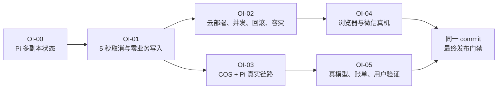

# AI 大学生简历助手发布阻断项解决计划

> 日期：2026-07-29  
> 适用范围：`main` 分支当前实现及 `docs/acceptance/open-issues.md` 中的未关闭问题  
> 目标：在不扩展 MVP 功能范围的前提下，消除公开运营前的工程阻断，并按 `11-acceptance-and-evidence.md` 形成可复核证据

## 1. 结论与执行顺序

当前不能直接进入“部署后补证据”阶段。Pi 的运行状态只保存在单进程内存中，而生产清单允许多个 Pi 副本；这会使创建、查询和取消请求落到不同副本时出现 `run_not_found`。该问题应登记为 OI-00，并作为 OI-01、OI-02、OI-03 的共同前置项。

执行顺序固定为：

1. OI-00：Pi 多副本运行状态与取消协调。
2. OI-01：任务取消传播和业务写入隔离。
3. OI-02、OI-03：云环境、COS、Pi、队列、回滚和容灾验证。
4. OI-04：Web 真浏览器和微信小程序真机验证。
5. OI-05：真模型评测、成本账单核对和学生用户验证。
6. 在同一候选 commit 上重跑发布门禁并汇总证据。



## 2. 范围、假设与非目标

### 2.1 已知前提

- 单人开发，暂按每个工作日 6 小时有效开发时间估算。
- 两周共 10 个工作日，每个 Sprint 毛容量 60 小时。
- 每个 Sprint 预留 12 小时用于缺陷修复、部署等待和证据整理，可承诺容量为 48 小时。
- 本地缺少 Docker 不能代替云环境验证；容器、网络、COS、真实浏览器、微信真机和模型供应商证据必须在相应真实环境产生。
- FastAPI 继续作为唯一公开业务入口和业务事实拥有者，Pi 不直连 PostgreSQL。
- PostgreSQL 保存业务事实和审计事实；Redis 只保存可过期的运行协调状态，不作为不可恢复事实源。

### 2.2 本计划不包含

- 支付、会员、商业主体注册和新商业功能。
- OCR、第三方简历模板市场、新模型供应商。
- Web 与小程序 UI 的重新设计。
- 为未来场景增加与当前验收无关的抽象层。

### 2.3 Definition of Ready

一个任务只有同时满足以下条件才进入开发：

- 对应验收 ID、失败现象和期望断言已明确。
- 修改注册点、数据迁移、回滚方法和证据输出位置已明确。
- 所需云账号、COS、Redis、模型密钥、微信开发者工具或真机已可用；不可用的任务标记 `BLOCKED`，不以本地夹具替代。
- 新增生产依赖已说明原因和替代方案。

### 2.4 Definition of Done

一个任务只有同时满足以下条件才算完成：

- 先有可复现失败的自动化用例，再有修复后的通过结果。
- 单元、集成、契约和受影响的 E2E 全部通过。
- 数据迁移可向前执行；回滚边界和失败处理已验证。
- 证据包含命令、UTC 时间、commit、环境、原始日志或截图及 SHA-256。
- 对应验收项被更新为 `PASS`、`FAIL` 或 `BLOCKED`；没有外部证据时不得写 `PASS`。

## 3. 关键技术设计

### 3.1 Pi 多副本 RunStore

新增最小 `RunStore` 接口，提供：

- 创建运行；
- 查询运行状态和小型终态摘要；
- 记录 owner instance；
- 请求取消；
- 完成、失败和过期；
- 订阅当前实例的取消通知。

实现两个适配器：

- `MemoryRunStore`：只供无 Redis 的确定性单元测试和本地夹具使用。
- `RedisRunStore`：生产实现，TTL 固定 24 小时；保存 `ai_run_id`、状态、owner instance、取消标记和终态摘要。

每个 Pi 实例只在本地保存本实例正在运行的 `AbortController`。取消请求先原子写入 Redis，再发布到 `pi.cancel.<instance_id>`；拥有该运行的实例收到通知后执行 abort。任意副本都从 Redis 查询状态，因此查询不再依赖最初接收请求的进程。

Redis 故障时：

- 新建 AI 运行返回可重试错误，不进入“已接受但不可查询”的状态。
- 查询返回明确的临时不可用错误。
- 正在运行的本地请求仍受本地超时保护，但不得把 Redis 恢复前的未知结果写成业务成功。

需要新增 Node 生产依赖时，优先使用官方 `redis` 客户端。原因是 Pi 当前没有 Redis 客户端，而自行实现 RESP、订阅重连和原子脚本风险更高；这是本计划唯一预期新增的生产依赖。

### 3.2 FastAPI 任务与 Pi 运行绑定

在 `Task` 上增加最小生命周期字段：

- `active_ai_run_id`：当前尝试的 Pi 运行 ID；
- `ai_cancel_requested_at`；
- `ai_cancel_acknowledged_at`。

绑定时必须同时校验 owner、task_id 和当前 claim token。Worker 重试创建新运行时覆盖当前 active ID；旧运行必须先取消或已处于终态。完整 AI 审计继续写入现有 `AiRun`，不让 Pi 访问业务数据库。

`InternalAiClient.run()` 接收任务取消上下文：

1. Pi 创建运行后立即持久化 `active_ai_run_id`。
2. 轮询间隔不超过 500 ms。
3. 发现任务取消后调用 Pi cancel。
4. 收到 Pi 取消确认后写入 `ai_cancel_acknowledged_at`。
5. 不再等待供应商正常完成，不返回可用于业务写入的结果。

### 3.3 事务级业务写入栅栏

仅在客户端轮询取消不够，因为取消可能恰好发生在 AI 返回和业务写入之间。所有 AI 结果应用必须增加同事务栅栏：

1. 在准备写入 Job、Match、Suggestion、Fact 或 ResumeVersion 的数据库事务内，以 owner、task_id、claim token 查询并锁定 Task。
2. 断言任务仍为可运行状态、没有 `cancel_requested_at`、claim token 未失效。
3. 仅在断言通过后写入业务结果和终态事件。
4. 取消事务通过相同 Task 行锁串行化；谁先获得锁决定合法顺序。
5. 若取消先提交，结果事务必须回滚，业务写入数为 0。

这条栅栏覆盖所有当前和未来 AI 工作流，不能只在 HTTP 层或单个 Job 服务中实现。

## 4. Sprint 计划

### Sprint 1：多副本安全与真实取消

**Sprint Goal：任意 Pi 副本都能查询和取消运行，并在取消后 5 秒内停止 AI 链路且不产生业务写入。**

容量：48 小时承诺，12 小时缓冲。

| ID | 工作项 | 估算 | 依赖 |
|---|---|---:|---|
| S1-01 | 先补多副本和取消竞态失败测试 | 6h | 无 |
| S1-02 | 实现 RunStore、Redis 协调和实例取消订阅 | 16h | S1-01、Redis 依赖决策 |
| S1-03 | 增加 Task 与 Pi run 绑定迁移及仓储方法 | 8h | S1-01 |
| S1-04 | 改造 InternalAiClient、Worker 取消传播和事务栅栏 | 12h | S1-02、S1-03 |
| S1-05 | 完成 20 任务验收、故障注入和证据归档 | 6h | S1-04 |

#### S1-01：失败用例和契约冻结

- 输入：当前 `Map` RunStore、AI-12 验收条款、现有取消测试。
- 处理：
  - 增加两个 Pi 实例共享同一 Redis 的 create/get/cancel 集成测试。
  - 增加“AI 已返回但结果尚未写库时取消”的确定性竞态测试。
  - 增加 20 个运行中任务取消测试的证据脚本。
- 输出：在修复前稳定失败的测试和严格 RunStore 契约。
- 架构师注册点：
  - `packages/ai/src/server/app.ts`
  - `packages/ai/tests/`
  - `packages/api/tests/test_ai_cancellation.py`
  - `tests/acceptance/`
- 测试员断言：
  - 跨副本查询和取消不得出现 `run_not_found`。
  - 取消后最后一个 token/tool 事件距请求时间不超过 5 秒。
  - Job、Match、Suggestion、Fact、ResumeVersion 的新增数均为 0。
- 交付官门禁：必须保存修复前 RED 日志；没有 RED 证据不得关闭 S1-01。

#### S1-02：RunStore 与 Redis 协调

- 输入：S1-01 契约、Pi 现有状态机、Redis 测试实例。
- 处理：抽离内存 Map，实现 Memory/Redis 两个适配器、实例 ID、TTL、取消 pub/sub、重连和原子状态迁移。
- 输出：多副本可共享的 Pi 运行状态。
- 架构师注册点：
  - `packages/ai/src/server/run-store.ts`
  - `packages/ai/src/server/memory-run-store.ts`
  - `packages/ai/src/server/redis-run-store.ts`
  - `packages/ai/src/server/app.ts`
  - `packages/ai/src/config.ts`
  - `packages/ai/package.json`
  - Pi 部署环境变量与健康检查
- 测试员断言：
  - 双副本循环 create/get/cancel 100 次，成功率 100%，`run_not_found` 为 0。
  - owner 副本终止后，状态仍可查询；运行进入超时或明确失败终态，不永久卡在 running。
  - Redis key 在 24 小时后可过期，业务数据库中的审计事实不丢失。
- 交付官门禁：单实例、多实例、Redis 重启和副本终止四组测试全部通过。

#### S1-03：任务与 Pi 运行绑定

- 输入：现有 Task、AiRun 模型和 Worker claim/lease。
- 处理：增加数据库迁移、TaskService 原子绑定/取消确认方法、owner 和 claim token 条件。
- 输出：可追溯且能跨进程取消的 active run 映射。
- 架构师注册点：
  - `packages/api/app/db/models.py`
  - `packages/api/alembic/versions/0007_task_ai_run_cancellation.py`
  - `packages/api/app/services/tasks/service.py`
  - API 模型、仓储和迁移契约测试
- 测试员断言：
  - 非 owner、过期 claim、旧重试均不能覆盖 active run。
  - 同一 claim 的幂等重放返回同一绑定结果。
  - 取消时间和确认时间单调且不可被旧 Worker 清除。
- 交付官门禁：迁移升级成功；旧数据读取正常；生产回滚边界写入 runbook。

#### S1-04：端到端取消传播与写入栅栏

- 输入：RunStore、active run 映射、Job/Match AI 工作流。
- 处理：传递 claim 上下文、最多 500 ms 检查取消、调用 Pi cancel，并在每个 AI 业务写事务中加 Task 行锁栅栏。
- 输出：取消信号从 FastAPI 持久化到 Pi AbortSignal 的完整链路。
- 架构师注册点：
  - `packages/api/app/integrations/ai_client.py`
  - `packages/api/app/workers/pipeline.py`
  - Job、Match 及其他调用 AI 的服务
  - TaskService 事务栅栏
  - Pi cancel handler 和 trace 事件
- 测试员断言：
  - 取消发生于排队、运行、AI 返回前、AI 返回后写库前四个阶段时，状态均合法。
  - 取消先提交时，业务结果事务必定回滚。
  - 成功先提交时，后续取消返回既有终态，不把 succeeded 改为 cancelled。
- 交付官门禁：状态机测试、竞态测试和 API/Pi 真实 schema 测试全部通过。

#### S1-05：AI-12 验收证据

- 输入：S1-04 候选 commit、20 个受控运行中 AI 任务。
- 处理：批量取消、采集 API/Worker/Pi/Redis/PostgreSQL 时间线和业务表差异。
- 输出：AI-12 证据包。
- 测试员断言：
  - 20/20 任务在 5 秒内停止产生模型 token/tool 事件。
  - 20/20 最终为 cancelled 或规格允许的既有终态。
  - 取消任务的业务新增写入总数为 0。
- 交付官门禁：证据包具有 commit、UTC 时间、环境、原始日志和 SHA-256。

### Sprint 2：云生产基线与真实外部链路

**Sprint Goal：候选 commit 能以不可变镜像部署到 staging，并完成 COS、Pi、队列、并发、回滚和容灾验证。**

容量：48 小时承诺，12 小时缓冲。

| ID | 工作项 | 估算 | 依赖 |
|---|---|---:|---|
| S2-01 | 不可变镜像、扫描和部署前门禁 | 10h | Sprint 1 |
| S2-02 | staging 网络、服务和迁移验证 | 8h | S2-01、云资源 |
| S2-03 | COS + Pi 全链路 smoke 与安全断言 | 12h | S2-02、云凭据 |
| S2-04 | 50 RPS、AI/文件并发和故障注入 | 10h | S2-03 |
| S2-05 | 金丝雀、回滚、备份恢复和证据归档 | 8h | S2-04 |

#### S2-01：镜像与供应链门禁

- 输入：同一候选 commit、Web/API/Pi/Worker Dockerfile。
- 处理：构建 `${COMMIT_SHA}` 镜像、生成 SBOM、扫描漏洞和密钥、以 digest 推送。
- 输出：可追溯镜像清单。
- 验证点：
  - Critical/High 漏洞为 0。
  - 密钥扫描命中为 0。
  - 所有部署引用 digest 或不可变 commit tag，不使用 `latest`。
- 交付门禁：任一镜像或扫描失败则停止部署。

#### S2-02：staging 基线

- 输入：镜像、迁移、CloudBase 或目标云部署清单。
- 处理：部署至少 2 个 API 副本、独立 AI/File Worker、非公网数据库/Redis/Pi，并验证 live/ready/version。
- 输出：可进行真实链路测试的 staging。
- 验证点：
  - 公网访问 PostgreSQL、Redis、Pi 的成功次数为 0。
  - `/version` 返回的 commit 与候选 commit 完全一致。
  - 迁移只运行一次且所有副本 ready。
- 交付门禁：网络隔离、版本和迁移任一不一致则停止后续测试。

#### S2-03：COS 与 Pi 真实 smoke

- 输入：staging、COS、Redis、真实 Pi 服务、专用测试用户。
- 处理：执行登录→预签名上传→COS PUT→确认→导入→事实确认→岗位→Pi→建议→导出→下载→清理。
- 输出：OI-03 全链路证据。
- 验证点：
  - 对象 key 使用不含邮箱/手机号的 opaque owner scope。
  - 跨 owner 读取、确认、下载和删除成功次数为 0。
  - 错误内部令牌访问 Pi 返回 401；公网不能直接访问 Pi。
  - Worker 内网调用 Pi 20/20 成功。
  - 上传文件、数据库 hash、COS 对象、导出下载文件 hash 前后一致。
  - 同一 `trace_id` 能串联 API、Outbox、Worker、Pi 和终态。
- 交付门禁：链路或安全断言任一失败，OI-03 保持 `FAIL`。

#### S2-04：容量和故障注入

- 输入：staging、k6 脚本、100 个隔离测试账号。
- 处理：运行非 AI 50 RPS、10–20 AI 并发、5–10 文件并发，并注入 API 重启、Worker 重启、Redis 短暂不可用和 Pi 超时。
- 输出：容量、恢复和无丢任务证据。
- 验证点：
  - 非 AI 关键读接口 p95 不超过 500 ms，错误率低于 1%。
  - 100 个已接受任务全部可在数据库找到，最终进入终态或可解释重试态。
  - API 单副本重启造成的可用性中断小于 5 秒。
  - Redis/Pi 故障期间不出现虚假 succeeded。
- 交付门禁：任务丢失数必须为 0。

#### S2-05：发布、回滚和容灾

- 输入：通过 S2-04 的镜像、备份和上一稳定版本。
- 处理：10% 金丝雀 30 分钟、应用回滚、迁移边界验证、备份恢复演练。
- 输出：OI-02 发布证据。
- 验证点：
  - 金丝雀期间门禁指标无回归。
  - 应用回滚不超过 15 分钟。
  - RPO 不超过 15 分钟，RTO 不超过 4 小时。
- 交付门禁：恢复数据 hash/计数与基线不一致则不得发布。

### Sprint 3：真浏览器、真机与评测工具

**Sprint Goal：建立可重复执行的 Web/小程序真实环境矩阵，并完成模型质量、成本和用户研究所需的证据工具。**

容量：48 小时承诺，12 小时缓冲。

| ID | 工作项 | 估算 | 依赖 |
|---|---|---:|---|
| S3-01 | Web staging real-API E2E 与浏览器矩阵 | 10h | Sprint 2 |
| S3-02 | 小程序真机验收包与网络/恢复场景 | 12h | Sprint 2 |
| S3-03 | 100 样本双人标注与模型评测工具 | 12h | 真实模型 |
| S3-04 | 成本账单核对和 70/90/100% 阈值验证 | 6h | S3-03、供应商账单 |
| S3-05 | 30 名学生研究脚本、埋点和汇总器 | 8h | staging |

#### S3-01：Web 真实浏览器

- 输入：staging、真实 API、Chrome/Edge/Safari 当前和前一主版本。
- 处理：把关键 E2E 从 fixture API 扩展为 staging real-API 套件，执行 390、1024、1440 px 和键盘可访问性检查。
- 输出：Web 兼容性证据矩阵。
- 验证点：
  - 零到简历、导入优化、建议接受/编辑/忽略/撤销、导出四条关键路径全通过。
  - Safari 证据来自真实 Safari，不以 Playwright WebKit 代替。
  - 无水平滚动；关键控件可通过键盘操作；焦点位于输入控件时 A/E/I/Z 不触发快捷操作。
- 交付门禁：每个浏览器和 viewport 均附版本、环境、截图或录像及日志。

#### S3-02：微信小程序真机

- 输入：微信开发者工具、1 台 iPhone、至少两个品牌 Android 真机、预览/体验版。
- 处理：执行冷启动、后台恢复、弱网、键盘遮挡、上传、优化和导出链路。
- 输出：小程序真机证据矩阵。
- 验证点：
  - 30 次冷启动成功率 100%。
  - 20 次后台恢复数据丢失次数为 0。
  - 30% 丢包和 400 ms 延迟下无重复业务写入。
  - 50 个键盘场景中主要输入框和提交按钮被遮挡次数为 0。
  - 主包与分包满足微信平台限制，并保留构建产物报告。
- 交付门禁：开发者工具模拟不能替代三台真机证据。

#### S3-03：真实模型质量评测

- 输入：去标识化的 100 个样本、两个独立标注员、固定模型和 prompt 版本。
- 处理：运行全链路、双人标注、分歧仲裁和 Cohen's kappa 计算。
- 输出：可复现质量报告和逐样本明细。
- 验证点：
  - 严重无依据声明为 0。
  - 新增无证据数字为 0。
  - 一般无依据声明率不超过 1%。
  - 可导出声明的来源覆盖率为 100%。
  - schema 首次通过率至少 98%，纠正后为 100% 或显式失败。
  - 标注一致性 kappa 至少 0.75。
- 交付门禁：样本、prompt、模型版本、输出 hash 和标注版本必须固定。

#### S3-04：成本和降级阈值

- 输入：100 次真实模型调用的供应商账单、UsageLedger 和成本配置。
- 处理：逐调用核对 token/费用，并通过隔离环境模拟日成本 70%、90%、100%。
- 输出：账单差异和阈值行为报告。
- 验证点：
  - 内部成本与供应商账单差异不超过 2%。
  - 70% 产生告警，90% 进入规格定义的降级，100% 停止新 AI 任务。
  - 已接受任务仍可追踪到合法终态。
- 交付门禁：不得修改生产账单；阈值演练只在隔离环境执行。

#### S3-05：用户验证准备

- 输入：验收标准、staging、30 名目标学生招募名单。
- 处理：准备同意书、任务脚本、埋点、计时和匿名反馈汇总器，先用 2 名内部试跑校验流程。
- 输出：可开始正式研究的研究包。
- 验证点：
  - 试跑中的所有指标都能从事件或录像复算。
  - 个人身份信息与简历正文不进入公开证据。
  - 正式样本不包含内部试跑人员。
- 交付门禁：任何无法复算的指标先修正埋点，不进入正式研究。

## 5. 外部验证窗口

该阶段受招募、设备和云资源影响，不承诺塞入 48 小时 Sprint；预计需要 1–2 个自然周，可与 Sprint 3 后半段交叠。

### V-01：30 名学生正式验证

- 每条主路径至少 15 人执行。
- 至少有 2 段可验证经历的用户占比不低于 70%。
- 零到简历完成率不低于 45%，完成者中位时长不超过 20 分钟。
- 已有简历优化完成率不低于 35%，完成者中位时长不超过 10 分钟。
- 已接受加已编辑建议数 / 已决策建议数不低于 60%。
- 建议理由理解率不低于 90%。
- 严重编造报告率低于 1%，且每条可追溯。
- 导出成功率不低于 99%。
- 重复问题率低于 5%。

任何指标未达标时，先将失败样本归类为产品、模型、性能或研究执行问题，再决定是否进入一次受控修复波次；不得删除失败样本或只报告完成用户。

### V-02：外部环境补证

- 完成三台真机、真实 Safari、供应商账单、COS 清理清单、备份恢复和告警通知证据。
- 外部账号或资源不可用时保持 `BLOCKED`，并在问题清单写明责任人、下一动作和预计可用时间。

## 6. 三次九轮检查机制

每次检查都按“架构师 → 测试员 → 交付官”三轮执行，共三次九轮。

| 检查 | 架构师：影响与注册点 | 测试员：用例与断言 | 交付官：门禁 |
|---|---|---|---|
| 第一次：编码前 | 校验服务边界、状态拥有者、迁移和队列/配置注册点 | 先写失败用例，确认能稳定复现 | 检查 DoR、依赖和回滚边界，不满足不编码 |
| 第二次：合并前 | 检查跨副本、竞态、owner、幂等和失败模式 | 运行单元、集成、契约、竞态和安全测试 | 检查 CI、生成物、迁移和文档是否与代码同 commit |
| 第三次：发布前 | 检查真实拓扑与本地假设是否一致 | 在 staging、真机、真浏览器、真模型重跑 | 只接受带原始证据和 SHA-256 的 PASS |

每轮采用统一记录：

```text
输入 -> 处理 -> 输出 -> 验证点
失败现象 -> 根因 -> 修改注册点 -> 回归用例
命令 -> UTC 时间 -> commit -> 环境 -> 原始证据 -> SHA-256
```

## 7. 风险、缓解与触发条件

| 风险 | 概率/影响 | 缓解 | 触发后动作 |
|---|---|---|---|
| Redis pub/sub 断线造成取消未送达 | 中/高 | 取消标记持久化；实例重连后补查本实例 running 集合；本地超时兜底 | 任一 20 任务测试超过 5 秒即阻断发布 |
| AI 返回与取消同时发生导致脏写 | 中/高 | Task 行锁、claim token 和同事务写入栅栏 | 竞态测试出现一次业务写入即回滚实现 |
| 云账号、备案、微信主体或设备不足 | 中/高 | 提前列资源清单，工程任务与外部证据分开 | 保持 BLOCKED，不用模拟证据替代 |
| 真模型结果波动 | 高/高 | 固定模型/prompt/样本；保留逐样本输出；双人标注 | 指标失败时定位 prompt、schema 或事实门控，重新跑全量 |
| 单人开发上下文切换过多 | 高/中 | 每个 Sprint 只承诺一个 Goal；保留 20% 缓冲 | 延后非阻断体验优化，不压缩安全测试 |
| 新迁移影响现有任务 | 低/高 | 只增加 nullable 字段和索引；先 staging；备份后迁移 | 数据兼容失败时停止金丝雀并应用回滚 |

## 8. 最终发布门禁

最终候选版本必须基于同一个 commit 完成：

```bash
pnpm install
pnpm lint
pnpm test
pnpm build
pnpm test:contract
pnpm acceptance
```

并额外通过：

- Pi 双副本 Redis 集成测试 100 次；
- AI-12 的 20 个运行中任务取消测试；
- staging 50 RPS、10–20 AI 并发、5–10 文件并发；
- COS + Pi 真实 smoke；
- Web 浏览器矩阵和微信三台真机矩阵；
- 100 样本真模型质量与成本评测；
- 30 名学生正式验证；
- 金丝雀、回滚、备份恢复和清理演练。

最终证据目录建议：

```text
artifacts/acceptance/<commit>/
  manifest.json
  oi-00-pi-multi-replica/
  ai-12-cancellation/
  cloud-release/
  cos-pi-smoke/
  web-browser-matrix/
  miniprogram-device-matrix/
  model-evaluation/
  billing-reconciliation/
  user-validation/
```

`manifest.json` 必须记录每个验收 ID、状态、命令、UTC 时间、commit、环境、证据相对路径和 SHA-256。证据生成后代码发生变化，必须在新 commit 上重跑受影响门禁；不能沿用旧 commit 的 PASS。

## 9. 预计周期与里程碑

- Sprint 1：2 周内完成 OI-00/OI-01 工程闭环。
- Sprint 2：2 周内完成 OI-02/OI-03 的 staging 工程验证。
- Sprint 3：2 周内完成 OI-04/OI-05 的工具和测试准备。
- 外部验证：约 1–2 个自然周，可与 Sprint 3 部分交叠。

按单人开发和资源均及时到位估算，工程工作约 144 个有效小时，日历周期约 6–8 周。若云账号、微信真机、模型账单或用户招募未就绪，工程部分可继续推进，但对应公开发布状态保持 `BLOCKED`。
