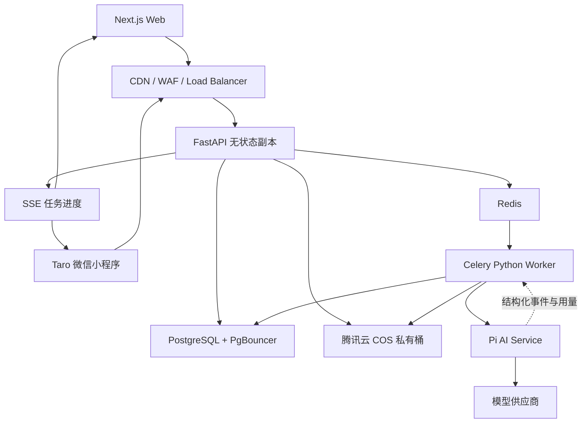

# AI 大学生简历助手系统规格

> 状态：用户已于 2026-07-27 书面确认，实施中
> 日期：2026-07-27
> 依据：[PRD](../../../PRD-AI-大学生简历助手.md)、[竞品调研](../../../竞品调研-AI大学生简历助手.md)
> 适用版本：公开运营 MVP，Web 与微信小程序同时上线

## 1. 文档目标

本规格把产品、交互、视觉、代码、AI、数据、并发、运维和验收统一成一个可以实施、测试和发布的基线。它不替代 PRD，而是回答以下问题：

1. Web 和微信小程序分别交付什么，哪些能力必须一致。
2. Next.js、Taro、FastAPI 与 Pi 如何分工。
3. 事实、简历、岗位、建议和版本如何建模。
4. 系统如何承受公开 MVP 的并发，失败时如何恢复。
5. Pi 如何用于逐层链路监测，而不记录用户隐私或模型思维过程。
6. 每项功能如何验收，必须提交什么测试证据。

## 2. 已确认决策

| 项目 | 决策 |
| --- | --- |
| 用户 | 中国大陆高校的实习、校招学生 |
| 客户端 | Web 与微信小程序同时上线 |
| 功能关系 | 两端业务能力对等，交互按屏幕和平台能力分别设计 |
| Web | Next.js App Router、React、TypeScript |
| 微信小程序 | Taro、React、TypeScript |
| 业务后端 | Python FastAPI 模块化单体 |
| AI 服务 | Node.js 内部服务，使用 `@earendil-works/pi-ai` 和按需使用 `@earendil-works/pi-agent-core` |
| 异步执行 | Redis + Celery；PostgreSQL 保存任务最终状态 |
| 文件 | 腾讯云 COS 私有桶，客户端使用短期预签名 URL 直传 |
| 导出 | 服务端统一生成 PDF；DOCX 不进入本版本 |
| 运营主体 | 首版按自然人个人主体准备公开运营 |
| 收费 | 本版本不收费，不开发支付；只保留用量账本和限额 |
| 容量基线 | 1,000 DAU、100 峰值在线、50 RPS、10–20 AI 并发、5–10 文件任务并发 |
| 架构策略 | 容器化、无状态副本、可横向扩容；首版不使用 Kubernetes |

## 3. 产品定位

> 不是替大学生编一份漂亮简历，而是通过具体问题找回真实经历，再为每个岗位做有依据的表达。

系统围绕三个不可破坏的原则设计：

1. **事实优先**：职责、工具、数字、技能和结果必须能映射到用户输入或已确认的导入内容。
2. **修改可解释**：岗位建议必须同时引用 JD 要求和事实来源。
3. **用户控制**：AI 结果只能进入建议区；用户接受、编辑或确认后才能进入正式版本。

## 4. 本版本交付范围

### 4.1 P0 业务闭环

两端均交付：

- 邮箱验证码登录；微信小程序额外支持微信登录。
- 通过已验证邮箱将 Web 与微信账号绑定为同一用户。
- “没有简历”和“已有简历”双入口。
- 求职方向与可选 JD 输入。
- 经历雷达、动态追问、事实卡片和即时内容预览。
- PDF、DOCX、TXT 简历导入；DOCX 是导入格式，不是导出格式。
- 解析结果确认与粘贴文本兜底。
- JD 结构化解析与用户修正。
- 已证明、表达不足、待确认、真实缺口四类匹配。
- 逐条建议的接受、编辑、忽略与撤销。
- 结构化简历编辑、模块增删、模块与条目排序、自动保存。
- 基础简历、岗位版本和不可变历史版本。
- 质量检查、事实来源查看、未确认事实导出拦截。
- 两个简洁单栏模板、实时预览、服务端 PDF 导出。
- 我的简历、经历事实库、任务中心、个人设置。
- 账户数据导出、账户与数据删除。
- 用量限制、任务排队、失败恢复和链路监测。

### 4.2 本版本不交付

- 支付、订单、优惠券和会员订阅。
- 招聘网站自动抓取、自动投递和投递追踪。
- OCR 扫描件识别；扫描件提示用户粘贴文本。
- DOCX 导出、英文简历、求职信和模拟面试。
- 导师批注、高校后台和招聘方后台。
- 让 Pi 执行文件系统、Shell、网络抓取或数据库写入工具。
- 单一 ATS 分数、面试承诺或自动编造量化结果。

## 5. 用户成功标准

| 用户路径 | 成功定义 |
| --- | --- |
| 从零创建 | 20 分钟内得到含至少两段真实经历、完成质量检查且可导出的草稿 |
| 已有简历优化 | 10 分钟内得到独立岗位版本，所有接受的建议均有 JD 与事实引用 |
| 跨端续接 | 任一端退出后，在另一端恢复到最近一次已确认步骤，已保存内容不丢失 |
| 事实保护 | 导出 PDF 中严重无来源事实为 0，数字无来源事实为 0 |

产品指标和发布门槛的具体口径见[验收与证据标准](./ai-resume-assistant/11-acceptance-and-evidence.md)。

## 6. 规格文档地图

| 文档 | 内容 |
| --- | --- |
| [01 产品范围与用户流程](./ai-resume-assistant/01-product-scope-and-user-flows.md) | 角色、状态、两条闭环、功能矩阵与事件 |
| [02 Web 功能规格](./ai-resume-assistant/02-web-functional-spec.md) | 页面、桌面与移动 Web 交互、编辑与恢复 |
| [03 微信小程序功能规格](./ai-resume-assistant/03-miniprogram-functional-spec.md) | 页面、平台能力、完整编辑、预览与导出 |
| [04 视觉设计系统](./ai-resume-assistant/04-visual-design-system.md) | 品牌方向、色彩、字体、组件、响应式与无障碍 |
| [05 技术选型与代码结构](./ai-resume-assistant/05-codebase-and-technology.md) | Monorepo、框架、包边界、依赖规则 |
| [06 系统架构与数据流](./ai-resume-assistant/06-system-architecture-and-data-flow.md) | 同步/异步链路、文件、导出、故障恢复 |
| [07 FastAPI 业务后端](./ai-resume-assistant/07-fastapi-business-backend.md) | 业务模块、事务、任务、错误与权限 |
| [08 Pi AI 工作流与链路监测](./ai-resume-assistant/08-pi-ai-workflows-and-observability.md) | Pi 包边界、Agent、事件、成本、事实校验 |
| [09 数据、API 与安全](./ai-resume-assistant/09-data-model-api-and-security.md) | 核心对象、状态机、API 契约、隐私和保留策略 |
| [10 并发、部署与运维](./ai-resume-assistant/10-concurrency-deployment-and-operations.md) | 容量、限流、扩缩容、SLO、告警与回退 |
| [11 验收与证据标准](./ai-resume-assistant/11-acceptance-and-evidence.md) | 可量化门槛、测试方法、证据目录和发布判定 |
| [12 版本交付清单](./ai-resume-assistant/12-release-deliverables.md) | 阶段、制品、文档、运行手册和交付完成定义 |

## 7. 总体架构

硬边界：

- 客户端只能访问公开 FastAPI，不直连 Pi、数据库或对象存储密钥。
- Pi 不拥有业务数据库写权限，不保存用户账户，不执行任意系统工具。
- PostgreSQL 是业务事实和任务状态的最终来源；Redis 只保存短期队列、限流和事件。
- AI、解析与导出失败不能回滚已经确认的用户事实。

## 8. 关键质量门槛

以下任一项失败，版本不得公开发布：

1. 任一未确认职责、数字、技能或结果能进入导出 PDF。
2. 岗位优化覆盖或修改基础简历。
3. 文件、AI 或导出失败导致已保存输入丢失。
4. 无法从 `trace_id` 定位到任务、Pi run、模型、token、成本和校验结果。
5. 日志或链路事件包含完整简历正文、手机号、邮箱或模型思维内容。
6. 100 并发用户测试中非 AI API 错误率达到或超过 1%。
7. 账户删除后仍能通过公开 API 读取相关简历、事实、JD 或文件。

## 9. 设计假设

为消除实现歧义，本版本采用以下明确假设：

- Web 首选邮箱验证码登录；小程序首选微信登录。跨端同步通过已验证邮箱绑定。
- 中文是唯一内容语言。
- 用户上传文件不超过 10 MB、10 页；超限在上传前拦截。
- 事实状态只有 `unconfirmed`、`confirmed`、`rejected` 三种。
- 每个岗位版本必须引用一个基础简历版本和一个已确认 JD。
- 默认每用户每日最多发起 20 个 AI 任务、同时运行 2 个；全局每日 AI 成本上限 100 元人民币。
- 达到全局成本的 70% 告警、90% 限制非必要重试、100% 停止新的 AI 任务，但保留编辑、查看和导出。
- 原上传文件在解析确认后 24 小时内自动删除；用户可以立即删除。
- 导出文件保留 7 天；过期后可重新生成。

这些数字是公开 MVP 的运行默认值，不代表永久商业规则；任何调整必须通过版本化配置和发布记录完成。

## 10. 参考依据

- [Next.js App Router](https://nextjs.org/docs/app)
- [Taro 官方文档](https://docs.taro.zone/docs/)
- [FastAPI 官方文档](https://fastapi.tiangolo.com/)
- [Pi 官方仓库](https://github.com/earendil-works/pi)
- [Pi SDK 事件](https://pi.dev/docs/latest/sdk)
- [Pi JSON Event Stream](https://pi.dev/docs/latest/json)
- [Celery 官方文档](https://docs.celeryq.dev/)
- [腾讯云 CloudBase Run 自动扩缩容](https://cloud.tencent.com/document/product/1243/46250)
- [腾讯云 COS 预签名 URL](https://cloud.tencent.com/document/product/436/35153)
- [微信小程序备案适用范围](https://www.miit.gov.cn/zwgk/zcwj/wjfb/tz/art/2023/art_920db564162e4312916a01bed6540ad8.html%EF%BC%9B)
