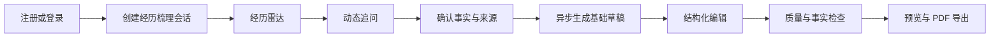
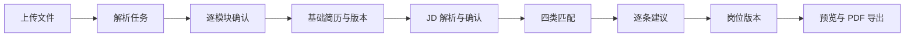

# AI 大学生简历助手 V2 主规格

> 状态：`READY FOR IMPLEMENTATION`  
> 版本范围：Web V2 工程闭环；公开发布仍受小程序对等与外部证据门禁约束  
> 基线 commit：`ab89b8b5ac19e7fc657eb5cf7f1a831dccb38762`，另含当前工作区未提交修改  
> 最后更新：2026-07-30

## 1. 结论

V2 不是一次视觉换皮。它要把当前“页面存在，但页面中的业务状态不一定来自后端”的原型，改造成可以连续完成真实任务、刷新后可恢复、失败后可继续、每个关键结果可追溯的 Web 产品。

V2 的产品承诺是：

> 用户输入一次真实信息，系统把它保存为有来源的事实，并在创建、编辑、岗位匹配、建议和导出中持续复用；界面不展示伪造的简历、任务、用量、建议或成功状态。

当前版本不得公开发布。原因不是界面不够漂亮，而是关键页面仍存在静态业务数据、未接通读取链路、路由未鉴权、端到端测试只使用浏览器内 fixture 等 P0 问题。详见[当前实现差距审计](./01-current-state-gap-audit.md)。

## 2. 规格优先级

本目录是 V2 Web 的执行规格。出现冲突时按以下顺序解释：

1. 本主规格与[验收及证据标准](./05-acceptance-and-evidence.md)；
2. 本目录其他子规格；
3. 现有 `ai-resume-assistant` V1 规格；
4. 2026-07-27 实施计划和 2026-07-29 发布阻断计划。

V1 中关于 FastAPI 事实所有权、简历版本不可变、owner SQL 条件、幂等、文件安全、异步任务、Pi 内网边界和外部证据不得伪造的要求继续有效。

## 3. 问题定义

当前 Web 的主要问题是“视觉上完整，业务上断裂”：

- 静态导航文字本身没有问题，但导航指向的首页、简历、事实、任务和设置页面没有读取真实用户数据；
- 创建页会写入 Fact 和 Resume，但固定六题不是经历雷达，也没有持久化会话、动态追问、刷新恢复和草稿版本；
- 导入页真的上传文件，却不展示解析结果，而是用固定模块和“待用户确认”文本创建事实；
- 编辑器不读取目标简历，反而以固定示例初始化，并把简历文案本身重新创建为“已确认事实”；
- JD 页真的发起解析任务，但显示的是固定要求；建议页真的调用决策接口，但展示和编辑的是固定建议；
- E2E 测试拦截全部 API，不能证明浏览器、FastAPI、PostgreSQL、Redis、Worker 和 Pi 形成真实链路；
- 无会话级路由保护，未登录用户也能打开用户数据页面壳。

这种混合实现比纯静态原型更危险，因为用户会把固定内容误认为系统真实读取或生成的结果。

## 4. V2 目标与成功指标

### 4.1 产品目标

V2 必须让 Web 独立完成两条闭环：

1. 从零创建：注册或登录 → 经历雷达 → 动态追问 → 事实确认 → 基础简历草稿 → 编辑 → 质量检查 → PDF。
2. 已有简历优化：登录 → 上传 → 解析确认 → 基础简历版本 → JD 确认 → 四类匹配 → 逐条建议 → 岗位版本 → PDF。

### 4.2 工程成功指标

- 两条流程在本地真实服务拓扑各连续执行 10 次，成功 10/10；测试不得拦截 `/api/v1/**`。
- 刷新、返回或关闭浏览器后恢复已保存步骤，30 次恢复丢失 0 次。
- 生产 Web 包中已知示例用户内容、示例资源 ID 和伪任务状态命中 0。
- 所有用户可见业务状态均能定位到一个 API 响应或明确的本地未同步草稿。
- 所有写请求带幂等键；相同键相同请求重放 10 次只产生一个业务结果。
- 用户可导出的每个原子声明都有已确认、有来源的事实覆盖，未覆盖导出成功 0 次。
- 390×844、1024×768、1440×900 三个交付视口的关键状态均有真实浏览器截图。

### 4.3 用户验证指标

这些指标必须由真实目标用户产生，不能由开发者或 fixture 代替：

- 每条主路径至少 15 名学生；
- 从零用户找到至少 2 段可验证经历的比例 ≥70%；
- 从零完成草稿并完成质量检查的比例 ≥45%，完成者中位时长 ≤20 分钟；
- 已有简历用户完成岗位版本并导出的比例 ≥35%，完成者中位时长 ≤10 分钟；
- 建议接受加编辑占已决策建议比例 ≥60%；
- 已确认信息重复提问率 <5%；
- 严重无来源事实为 0。

未取得真实用户证据时，上述项目必须是 `BLOCKED`，不能用内部试用结果写 `PASS`。

## 5. 目标用户与核心工作

### 5.1 从零创建者

用户不知道课程、社团、兼职、志愿和个人项目是否值得写。产品的工作不是替他编经历，而是通过具体场景问题找到可追问的事实，再把事实组织成简历。

### 5.2 岗位定向优化者

用户有通用简历和目标 JD，但不知道什么已经被证明、什么只是表达不足、什么需要确认、什么是真实缺口。产品必须解释建议依据，并保留基础版本。

## 6. V2 产品原则

1. **服务端是真相。** 正式事实、简历、版本、任务、建议、用量和文件状态只来自 FastAPI。
2. **静态配置与业务数据分开。** 导航名称、枚举标签、空状态文案可以写在前端；用户内容、计数、ID、状态和建议禁止写死。
3. **先保存，再宣称成功。** API 成功前不得显示“已保存”“已确认”“已完成”。
4. **一个页面一个主要任务。** 页面只保留一个主按钮；下一步由当前状态决定。
5. **失败可恢复。** AI、文件、网络或导出失败不删除已保存输入，并提供明确重试或手工继续路径。
6. **证据优先。** 建议、质量问题和导出阻断必须能展开查看来源。
7. **不制造焦虑。** 不使用 ATS 总分、虚构提升率、Offer 数或倒计时式催促。
8. **不以 fixture 冒充联调。** fixture 测试只证明客户端契约；真实闭环必须连接实际 FastAPI 和数据库。

## 7. 信息架构

登录后一级入口调整为：

1. **工作台**：下一步动作、最近简历、进行中/失败任务、当日用量；
2. **我的简历**：基础简历、岗位版本、历史版本；
3. **经历事实**：事实、状态和来源；
4. **任务中心**：解析、生成、匹配、导出和隐私任务；
5. **账号与数据**：放入账户菜单，不与日常工作入口等权展示。

岗位优化是从某个简历版本发起的上下文流程，不再作为无上下文的一级入口。

未实现真正命令面板前，删除“⌘ K 快速前往”伪入口。若作为 P1 实现，必须支持打开、搜索、键盘选择和安全跳转，而不是普通链接换皮。

## 8. 两条完整流程

### 8.1 从零创建



关键约束：

- 经历梳理会话必须由后端持久化，刷新后恢复；
- 问题由“后端确定性题库 + Pi 动态追问”共同产生，前端不自行决定业务问题；
- “没有”“不知道”“跳过”只保存为回答状态，不创建肯定事实；
- 生成草稿是异步任务，必须有任务阶段和失败恢复；
- 草稿必须创建首个不可变 `ResumeVersion`，不能只创建空 `Resume`。

### 8.2 已有简历优化



关键约束：

- 导入确认页必须渲染 `GET /v1/imports/{id}` 的真实 `draft_facts`；
- 未确认解析结果不能进入正式事实库；
- JD 要求必须来自服务端解析结果，用户可以逐条编辑和确认；
- 建议页必须显示服务端建议，不得以固定示例替换；
- 接受、编辑、忽略和撤销都创建或指向真实版本操作；
- 基础版本 hash 在岗位优化前后保持不变。

## 9. V2 API 增量

现有 Facts、Resumes、Imports、Jobs、Matching、Suggestions、Tasks、Exports、Usage 和 Privacy API 继续复用。V2 只增加当前闭环无法表达的最小契约：

```text
GET  /v1/me

POST /v1/intake-sessions
GET  /v1/intake-sessions/{session_id}
POST /v1/intake-sessions/{session_id}/answers
POST /v1/intake-sessions/{session_id}/drafts
```

要求：

- `GET /v1/me` 返回内部用户 ID、脱敏邮箱、身份类型和当前同意版本，不返回密码信息；
- `intake-session` 持久化当前问题、已回答 question ID、跳过状态、关联 Fact、当前 task 和草稿 Resume；
- 提交回答返回 `202 + task_id` 时，问题生成和事实提取由 Worker/Pi 异步完成；
- 同一已确认字段不得再次作为普通问题；若必须澄清，响应要带 `reason=conflict|missing_unit|ambiguous_role`；
- 所有新增写接口遵守 24 小时幂等、owner SQL 条件和同事务 Task/Outbox 规则。

如果实施前证明现有模型可在不牺牲恢复、去重和审计的前提下表达上述状态，可以取消新增资源；必须先写 ADR 和失败用例，不能在前端用 localStorage 临时代替正式事实。

## 10. V2 交付边界

V2 本轮交付：

- Web 的真实会话保护和两条端到端业务链；
- Web 所有页面的真实读取、写入、加载、空、错误和恢复状态；
- 必要的最小 FastAPI 契约增量；
- 同一 API 下的后台任务、事实和版本链路；
- 可复跑的真实服务 E2E、截图矩阵和证据 manifest；
- V2 视觉和交互系统落地。

本轮不新增：

- OCR、DOCX 导出、英文简历、付费、模板市场、自动投递；
- ATS 总分、虚构成功率、自动“全部接受”；
- 自由画布编辑器；
- 为仪表盘单独创建聚合 API；工作台先并行复用现有列表和用量接口。

小程序本轮不重做视觉，但公开发布前必须基于同一业务契约恢复功能对等。Web V2 可以先进入内部或 staging 验收，不能绕过项目既有的双端公开发布门禁。

## 11. 子规格

- [当前实现差距审计](./01-current-state-gap-audit.md)
- [Web 功能规格](./02-web-functional-spec.md)
- [视觉与交互规格](./03-visual-and-interaction-spec.md)
- [交付范围与完成状态](./04-delivery-scope-and-status.md)
- [验收与证据标准](./05-acceptance-and-evidence.md)
- [当前基线证据](./06-current-baseline-evidence.md)

## 12. 发布判定

只有以下条件同时满足，Web V2 工程版本才可标为 `ENGINEERING READY`：

- `V2-P0` 验收项全部 `PASS`；
- Sev1、Sev2 未关闭缺陷为 0；
- 两条真实服务 E2E 各 10/10；
- 关键 UI 状态截图矩阵完整且哈希可验证；
- 测试、截图、数据库断言和制品属于同一 commit/build；
- 没有生产业务页面依赖硬编码用户数据或 fixture 路由。

只有现有 V1 公开发布 P0（小程序、真模型、云、COS、浏览器矩阵、真实用户等）也全部 `PASS`，才能标为 `READY FOR PUBLIC RELEASE`。
