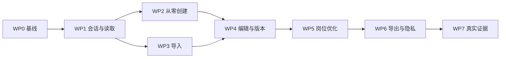

# Web V2 交付范围与完成状态

## 1. 状态口径

本文件只记录源码中可以验证的现状，不把计划、文件名或 fixture 成功视为已完成。

| 状态 | 含义 |
| --- | --- |
| `DONE-LOCAL` | 本地实现和聚焦测试已通过，但未形成同 commit 全量候选证据 |
| `PARTIAL` | 已有可复用实现，但不满足业务完成定义 |
| `NOT STARTED` | 没有真实实现或只有静态壳 |
| `BLOCKED` | 实现依赖真实云、设备、模型、账单或用户 |

## 2. 已完成和可复用

| 模块 | 状态 | 当前产物 | V2 处理 |
| --- | --- | --- | --- |
| 邮箱验证码登录 | `DONE-LOCAL` | Auth API、Cookie、限流、Web 表单 | 保留并纳入真实浏览器 E2E |
| 邮箱密码注册/登录 | `DONE-LOCAL` | scrypt、迁移、限流、注册/登录页、局部测试 | 保留；补会话守卫、真实截图和同 commit 证据 |
| 安全 returnTo | `DONE-LOCAL` | 站内路径校验 | 扩展到受保护 layout |
| 共享 API 客户端 | `PARTIAL` | cookie transport、ApiError、idempotency | 保留；所有页面统一使用 |
| FastAPI 核心资源路由 | `PARTIAL` | Facts、Resumes、Imports、Jobs、Matching、Suggestions、Tasks、Exports、Usage、Privacy | 保留；补 intake 和 `/v1/me` |
| 不可变简历版本与事实检查 | `PARTIAL` | 数据模型、迁移、服务和后端测试 | 保留；修正 Web 使用方式 |
| Task/Outbox/Worker | `PARTIAL` | 队列、claim/lease、events、取消实现 | 保留；补真实 Web 状态和外部证据 |
| Pi 工作流 | `PARTIAL` | analyze_intake_answer、compose_resume_draft、parse_jd、match_resume_to_jd 已进入业务调用链；generate_suggestions_batch 尚未接入 | 继续完成建议工作流，并补真实模型与跨服务证据 |
| 本地五服务启动 | `DONE-LOCAL` | Web、API、Pi、Dispatcher、Celery | 作为 real-service E2E 基线 |
| 编辑器本地操作 | `PARTIAL` | 20 步撤销、拆分/合并/增删/排序 reducer | 与服务端 snapshot 初始化和保存合并 |
| 自动保存 hook | `PARTIAL` | 800 ms、15 s、offline/error/conflict 状态 | 补真实恢复、冲突决策和离线草稿 |
| 创建页六个不同问题 | `DONE-LOCAL` | 不再每一步显示同一问题 | 仅作确定性 fallback 题库，不视为经历雷达完成 |
| 设计 Token 和基础 UI | `PARTIAL` | Button、Field、StatusTag、Workbench/Cobalt | 保留并补八状态、真实空/错/载入状态 |

## 3. 本轮交付状态

| 交付物 | 当前状态 | 完成条件 |
| --- | --- | --- |
| 受保护路由和会话恢复 | `DONE-LOCAL` | 未登录跳登录；登录后安全返回；拒绝站外 returnTo |
| 工作台真实数据 | `DONE-LOCAL` | Resumes/Tasks/Usage 三组 API 和局部失败 |
| 经历梳理会话 | `DONE-LOCAL` | 可恢复 session、确定性 fallback、Pi 动态分析、FactCandidate 审核、来源和回答版本均已接入；真实 provider 证据仍阻断 |
| 从回答到事实 | `DONE-LOCAL` | 跳过不建事实；确认、来源、冲突完整 |
| 初稿生成 | `DONE-LOCAL` | compose_resume_draft、确定性事实策略、精确 BulletFactLink、模型/规则 provenance、取消恢复和显式事实原文 fallback 已接入；真实 provider 证据仍阻断 |
| 上传与导入确认拆分 | `DONE-LOCAL` | 真实 draft_facts、编辑确认、删除和粘贴兜底 |
| 简历列表 | `DONE-LOCAL` | 真实列表、空/错/载入 |
| 编辑器读取链 | `DONE-LOCAL` | 读取 Resume/Version；不使用固定业务内容 |
| 编辑器完整保存 | `DONE-LOCAL` | 全字段 snapshot、base version、可见冲突合并和离线恢复 |
| 版本历史 | `DONE-LOCAL` | 真实列表、查看和恢复 |
| JD 确认 | `DONE-LOCAL` | 真实 requirements 读取、编辑、确认 |
| 匹配明细 | `PARTIAL` | 真实 requirement/fact 资源和可选 AI match 已接入；规则降级与模型 provenance 尚未区分 |
| 建议页 | `PARTIAL` | 真实 suggestion 资源、来源、编辑和版本结果已接入；建议内容仍由匹配服务拼接，未调用 suggestion workflow |
| 事实库 | `DONE-LOCAL` | 真实列表、筛选、来源和状态操作 |
| 任务中心 | `DONE-LOCAL` | 真实列表、events、取消和资源恢复 |
| 预览导出 | `DONE-LOCAL` | 导出任务恢复、签名下载、失败重试和幂等键处理 |
| 设置与隐私 | `DONE-LOCAL` | `/v1/me`、usage、data export、re-auth deletion、logout |
| 协议和隐私正文 | `DONE-LOCAL` | 独立用户协议和隐私政策页面 |
| 真实服务 Web E2E | `PARTIAL` | 已完成本地真实 FastAPI + Next 浏览器冒烟；仍缺规格要求的两流程各 10/10 正式 Playwright 证据 |
| 响应式截图证据 | `DONE-LOCAL` | 同 build 的 7 视口 × 8 页面共 56 张截图，另有 7 张核心流程截图和 SHA-256 manifest |
| 完整多状态证据矩阵 | `PARTIAL` | 仍缺 42 个主矩阵状态、16 个异常矩阵状态的逐项 API/DB/trace 证据 |
| Safari/Edge/staging | `BLOCKED` | 真实浏览器与 staging 环境 |
| 30 名学生验证 | `BLOCKED` | 每路径 ≥15 人及原始记录 |

## 4. V2 工作包

### WP0：冻结基线和证据口径

交付：

- 本目录六份规格；
- 当前页面真实截图；
- 当前 E2E 失败或通过的原始结果；
- fixture E2E 与 real-service E2E 明确分项目。

验证：

- 文档内部链接 100% 可解析；
- 每个当前状态都有源码或测试依据；
- 不把 working tree 修改写成已发布。

### WP1：会话和真实只读页面

交付：

- `GET /v1/me`；
- 受保护 layout；
- 工作台、简历列表、事实库、任务中心、版本历史、设置的真实读取；
- 统一 loading/empty/error。

验证：

- 禁用 API 时不出现示例业务内容；
- 注入唯一测试值后只显示该值；
- 未登录受保护路由 20/20 跳转。

### WP2：从零创建闭环

交付：

- intake session 数据模型、迁移、API、Worker 接线；
- 经历雷达、动态追问、事实确认；
- 初稿生成 task；
- Resume + 初始 Version + evidence。

验证：

- 10 个不同用户画像的问题序列不全部相同；
- 已确认字段重复问 <5%；
- 30 次刷新恢复丢失 0；
- “没有/跳过”变为肯定 Fact 0 次。

### WP3：导入闭环

交付：

- 上传页和确认页拆分；
- 真实解析结果、字段编辑、来源；
- 删除、粘贴兜底；
- 导入后基础版本。

验证：

- 30 份文件集；
- 确认前正式 Fact 新增 0；
- 页面固定模块冒充解析结果 0；
- 删除 20/20 后签名 URL 不可访问。

### WP4：编辑器和版本

交付：

- 服务端初始化；
- 全字段 snapshot；
- 自动保存、离线草稿、冲突合并；
- 质量和来源；
- 历史查看/恢复。

验证：

- 100 次随机编辑刷新丢失 0；
- 20 次冲突均可见，静默覆盖 0；
- 历史 snapshot hash 变化 0；
- 自证事实行为 0。

### WP5：岗位优化闭环

交付：

- JD requirements 读取/编辑/确认；
- 匹配明细；
- 真实建议和来源；
- A/E/I/Z；
- 独立岗位版本。

验证：

- 四种决策各 20 次一致；
- 建议固定示例命中 0；
- 基础版本 hash 改变 0；
- succeeded 前可决策建议数量 0。

### WP6：预览、导出和隐私

交付：

- 真实预览与模板；
- task 状态、失败恢复、签名下载；
- 数据导出、删除和退出；
- 协议/隐私页。

验证：

- 20 次导出成功和内容一致；
- 无来源版本导出成功 0；
- 数据导出/删除任务可追踪；
- 登出后旧 session 成功请求 0。

### WP7：真实证据和发布判定

交付：

- real-service Playwright；
- 390/1024/1440 截图；
- API/数据库断言；
- axe/Lighthouse；
- manifest 和 SHA-256；
- 发布报告。

验证：

- [验收标准](./05-acceptance-and-evidence.md)的 V2-P0 全部 PASS；
- 测试、截图、数据库和制品同 commit；
- 当前外部缺口继续 BLOCKED。

## 5. 推荐执行顺序

先完成读取链和会话守卫，再修改业务页。否则旧静态页面会继续掩盖 API 状态。

## 6. 本轮明确不做

- 小程序视觉重做；
- 新模板、模板市场；
- OCR；
- 英文；
- 支付；
- DOCX 导出；
- 批量接受建议；
- 以 dashboard 聚合 API 提前优化三次只读请求；
- 与 V2 闭环无关的代码重构。

## 7. 交付清单

- [x] V2 主规格与五份子文档；
- [x] 当前基线截图与证据索引；
- [x] 会话保护；
- [x] 所有只读页去静态业务数据；
- [x] 从零创建真实闭环；
- [x] 导入真实闭环；
- [x] 编辑与版本真实闭环；
- [x] 岗位优化真实闭环；
- [x] 导出和隐私真实闭环；
- [ ] real-service E2E；
- [x] 7 视口 × 8 页面响应式截图；
- [x] manifest、哈希、最终报告；
- [x] Hallmark 58 项审查；
- [x] `pnpm lint`、`pnpm test`、`pnpm build`；
- [ ] V2-P0 全部 PASS。

本轮证据见
[验证报告](./evidence/v2-implementation/2026-07-30/verification.md)。
`real-service E2E` 和 `V2-P0 全部 PASS` 保持未勾选，是因为规格要求的完整状态矩阵、
axe、API/数据库/trace 以及外部环境证据尚未全部形成；这不会被响应式截图或本地单元测试替代。
