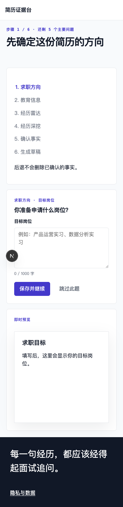
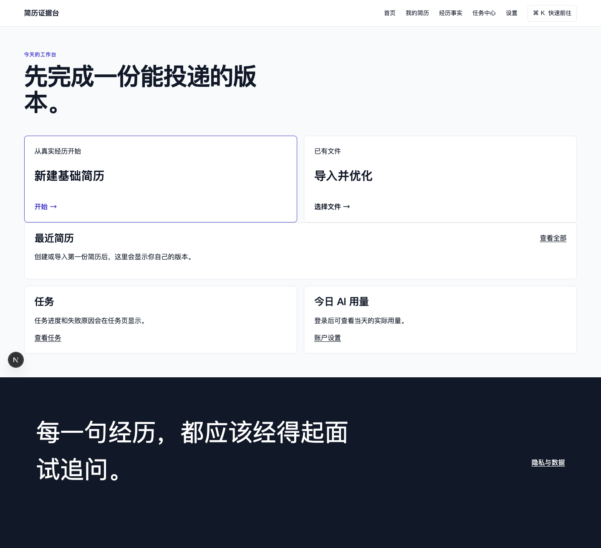

# Web V2 当前基线证据

> 证据状态：`BASELINE_DIRTY_WORKTREE`  
> 目的：证明当前实现现状和差距，不代表 V2 验收通过  
> commit：`ab89b8b5ac19e7fc657eb5cf7f1a831dccb38762`  
> 浏览器：Chrome 150.0.7871.187  
> 采集时间：2026-07-29T17:29:49Z 起  
> 环境：本机正在运行的 Next.js Web、全新无 Cookie 隔离浏览器

## 1. 可复跑命令

```bash
node scripts/acceptance/capture-v2-web-baseline.mjs
pnpm lint
pnpm test
pnpm build
pnpm --filter @resume/web test
pnpm --filter @resume/web lint
pnpm --filter @resume/web build
PLAYWRIGHT_BASE_URL=http://127.0.0.1:3000 \
  pnpm exec playwright test \
  tests/e2e-web/zero-to-resume.spec.ts \
  tests/e2e-web/optimize-existing.spec.ts \
  --grep completes --timeout=10000 --max-failures=2 --workers=2
```

截图采集脚本位于：

- [`scripts/acceptance/capture-v2-web-baseline.mjs`](../../../../scripts/acceptance/capture-v2-web-baseline.mjs)

完整 manifest：

- [截图 manifest](./evidence/current-baseline/manifest.json)

## 2. 命令结果

| 命令 | 结果 | 具体数字 | 原始证据 |
| --- | --- | --- | --- |
| `pnpm lint` | `PASS` | 全部 workspace 和 Python lint 退出码 0 | [log](./evidence/current-baseline/commands/root-lint.log) · [metadata](./evidence/current-baseline/commands/root-lint.json) |
| `pnpm test` | `PASS` | API 455；Web 21；Pi 71 通过、1 个真实 Redis 用例跳过；小程序 12；shared 8；tokens 2；supervisor 2 | [log](./evidence/current-baseline/commands/root-test.log) · [metadata](./evidence/current-baseline/commands/root-test.json) |
| `pnpm build` | `PASS` | Web、Pi、shared、tokens、小程序和 Python build 退出码 0；存在 browser mapping 数据过期和 Taro webpack cache 非阻断 warning | [log](./evidence/current-baseline/commands/root-build.log) · [metadata](./evidence/current-baseline/commands/root-build.json) |
| `pnpm --filter @resume/web test` | `PASS` | 7 files、21 tests，全部通过 | [log](./evidence/current-baseline/commands/web-test.log) · [metadata](./evidence/current-baseline/commands/web-test.json) |
| `pnpm --filter @resume/web lint` | `PASS` | 退出码 0 | [log](./evidence/current-baseline/commands/web-lint.log) · [metadata](./evidence/current-baseline/commands/web-lint.json) |
| `pnpm --filter @resume/web build` | `PASS` | Next.js production build 成功，13 个静态/动态页面生成 | [log](./evidence/current-baseline/commands/web-build.log) · [metadata](./evidence/current-baseline/commands/web-build.json) |
| 两条 fixture Playwright 主流程 | `FAIL` | 0/2 通过；从零流程找不到旧标签“你的回答”，导入流程无法进入 JD 页面 | [log](./evidence/current-baseline/commands/playwright-fixture-focused.log) · [metadata](./evidence/current-baseline/commands/playwright-fixture-focused.json) |

对应日志 SHA-256：

| 证据 | SHA-256 |
| --- | --- |
| Root lint | `4322f5f74c7a109393477a608d6f1b35a0c067a288cbeb28103e71a98a261307` |
| Root test | `33a4eb8efade5c52c8c7abce7808db8c9ba1e5ad597971c1b844096e2901f9ed` |
| Root build | `1fd99c9e66dc0248d7c7d38d37650c010ff3ca8bfcdcfd6347a3b67a9f92bcce` |
| Web test | `cf8693d866b0d02cc0a40e674c65bf36d91dc536af3345315872325788a276ba` |
| Web lint | `081b740eb376ce4ae5966aebc06ac43c3f2093803a90f3e5e89906498c543433` |
| Web build | `cf27b76fe3496863663174f7f6afeeb4585f0d20269191788d484ffd76da32dd` |
| Focused Playwright | `c23e9cefa592b43fb9d1b9e48ff3a90bc3ecb0d248d2561894349ad4a97f250f` |

结论：局部组件、lint 和构建健康；当前 E2E 与页面已经漂移，而且即使修正选择器，它仍是全量 API fixture，不能证明真实后端链路。

## 3. 真实浏览器截图结果

采集页面：

- `/home`
- `/create`
- `/resumes`
- `/facts`
- `/tasks`
- `/settings`

每页在 390×844 和 1440×900 各 1 张，共 **12 张真实 Chrome 截图**。

自动测量结果：

- HTTP 200：12/12；
- 无 Cookie：12/12；
- 首次加载业务 API 请求数：0/12 页，共 0 次；
- 水平溢出：0/12；
- Runtime Error overlay：0/12；
- 可点击文字换行：0/12。

这组结果同时证明两件事：

1. 当前基础响应式布局在两个采样宽度没有明显溢出；
2. 六个受保护业务页无登录即可打开，而且首次加载完全不读业务 API，所以其内容不能代表真实用户状态。

### 3.1 390×844

| 页面 | 截图 | SHA-256 |
| --- | --- | --- |
| 工作台 | [home.png](./evidence/current-baseline/390x844/home.png) | `2b7218b4e83bc89391f44231d4d72e3c699fab205b7b37568da026f9b264d082` |
| 创建 | [create.png](./evidence/current-baseline/390x844/create.png) | `a7e6348ba18f08139a8978f453e1415626ecf640e2a27300d549debfe4bd9d06` |
| 简历 | [resumes.png](./evidence/current-baseline/390x844/resumes.png) | `51ac79fbde4fd0b3ce5dfd48b4ce4f7d98bc363befacef7eb22f2d0e4c4752e9` |
| 事实 | [facts.png](./evidence/current-baseline/390x844/facts.png) | `f56a9bf6c43f69ca6e2353ec19ae147626ac69839aa0e4c0907c77aa1cf357e4` |
| 任务 | [tasks.png](./evidence/current-baseline/390x844/tasks.png) | `d38626b2af6c75d09f967032f5a4d5513f3a0efee9975ea82d482d4a4815554d` |
| 设置 | [settings.png](./evidence/current-baseline/390x844/settings.png) | `29e836072b85b177b609849edd56564287da5faebcb131b961671945192b3f49` |



### 3.2 1440×900

| 页面 | 截图 | SHA-256 |
| --- | --- | --- |
| 工作台 | [home.png](./evidence/current-baseline/1440x900/home.png) | `6013bbc7c31592986697939b9351813ab9965cb022d79914ae615898e67f9320` |
| 创建 | [create.png](./evidence/current-baseline/1440x900/create.png) | `f04f15b26f994ac3fd9142efb249395798f65a7b195af9e52acb5a792c72241a` |
| 简历 | [resumes.png](./evidence/current-baseline/1440x900/resumes.png) | `a15b8e4db8978cacb6c80315a25aa10fab437b3a3fd3d439df2226c6e88f30cc` |
| 事实 | [facts.png](./evidence/current-baseline/1440x900/facts.png) | `e3bb92563250ea87b0720c310e58baab5eeced89c20419d044185f1a289ff176` |
| 任务 | [tasks.png](./evidence/current-baseline/1440x900/tasks.png) | `0a2c902e3f2337fabbc9c3de144cc0d08508453dd55453c32b2a9cb30dd0d725` |
| 设置 | [settings.png](./evidence/current-baseline/1440x900/settings.png) | `e06beaa5331723b4cd187ece048f0bde0eb9758a40a97d8e2b7454fc6b4c81a9` |



## 4. 为什么当前不能通过 V2

- 12 张截图属于 dirty working tree，只能作为现状基线；
- 截图没有真实用户数据，更没有 API/数据库写入断言；
- 关键业务页首次加载没有 API 请求；
- 两条 Playwright 主流程当前失败；
- 现有 Playwright 使用 fixture API，不是 local real-services；
- 尚无 390/1024/1440 的 58 张 ready/异常状态交付矩阵；
- 尚无同 commit 的 PostgreSQL、Redis、Worker、Pi、PDF 和 screenshot 综合 manifest。

因此 V2 验收项当前保持 `FAIL` 或 `BLOCKED`，不能因单元测试和 build 通过而改为 PASS。
