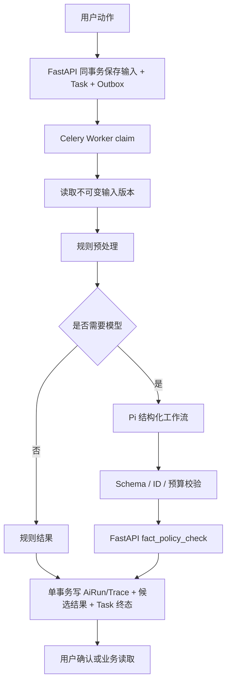
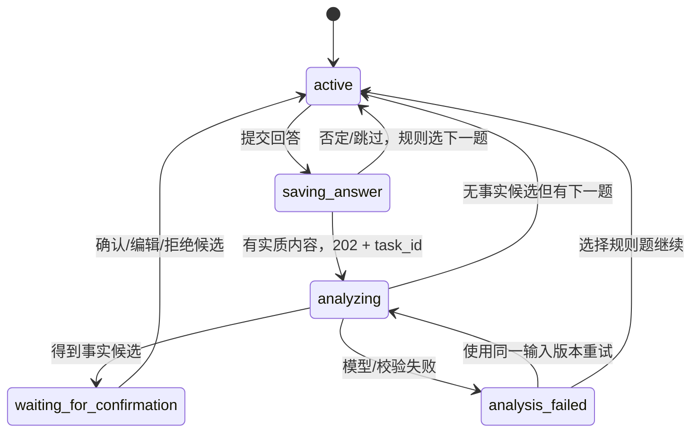
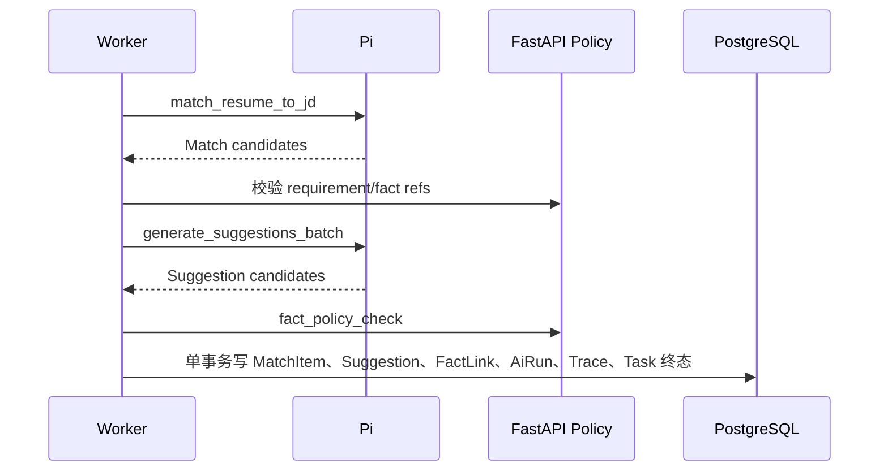

# PRD：AI 业务编排 V2.1

> 状态：`DESIGN APPROVED`
> 适用范围：Web、FastAPI、Celery Worker、Pi AI Service
> 规格优先级：补充并修正 V2 中“AI 工作流存在但业务未接线”的部分
> 最后更新：2026-07-30

## 1. Summary

当前系统已经具备模型路由、结构化输出、预算、取消和 Redis RunStore，
但八个 AI 工作流只有 `parse_jd` 和 `match_resume_to_jd` 进入业务调用链。
其余功能由规则实现或直接复制事实，导致文档承诺、用户体验和实际模型行为不一致。

V2.1 不把八个工作流机械地全部接上。它将能力收敛为五个有明确业务所有者的模型工作流，
并把事实验证和质量检查固定为 FastAPI 拥有的确定性策略。每个 AI 运行都必须能关联用户动作、
Task、输入版本、输出候选、最终业务对象和用户决策。

## 2. Contacts

| 联系人 | 角色 | 责任 |
| --- | --- | --- |
| 产品负责人 | 用户 | 确认产品边界、真实用户价值和发布判断 |
| Web / API / Pi 工程 | 项目开发者 | 实现业务编排、契约、迁移和真实服务测试 |
| 事实安全审查 | 发布前外部指定（当前 `BLOCKED`） | 审核无来源声明、数据发送字段和模型升级 |
| 验收负责人 | 发布前外部指定（当前 `BLOCKED`） | 独立复核测试、截图、数据库和 trace 证据 |

## 3. Background

### 3.1 为什么现在必须重做设计

V2 主规格要求：

- 问题由确定性题库和 Pi 动态追问共同产生；
- 提交回答后，问题生成和事实提取可由 Worker/Pi 异步完成；
- 初稿使用已确认事实生成可追溯 bullet；
- 匹配后展示真实、可解释、可决策的建议；
- 所有 AI run 都能追踪到 Task、模型、用量、校验和最终结果。

当前实现只满足了框架能力和部分岗位链路，没有满足完整业务编排。

### 3.2 Intended vs. Implemented 审计

| 设计意图 | 当前实现证据 | 实际差距 | 等级 |
| --- | --- | --- | --- |
| 回答后由规则与 Pi 共同产生下一题 | `IntakeService.answer` 直接调用 `_next_question`，没有 `AiClient` | `next_question` 工作流没有业务入口 | P0 |
| 回答或导入片段形成事实候选 | Intake 直接把非否定回答创建为 Fact；Import 使用本地解析器 | `extract_facts` 未调用，且没有独立 FactCandidate 审核边界 | P0 |
| 初稿由 AI 组织事实形成简历表达 | `process_draft` 把 `fact.value` 原样复制为 bullet | `write_experience_bullet` 未调用，“生成草稿”实际只是组装 | P0 |
| 每条岗位建议来自模型并有事实/JD 依据 | Matching 根据分类结果拼接 `证据文本：原文` | `generate_suggestion` 未调用，建议质量没有模型评测意义 | P0 |
| 质量检查覆盖来源和表达问题 | FastAPI 只有确定性质量规则 | `style_check` 未调用；规格没有说明哪些必须用模型 | P1 |
| 独立事实检查工作流保护写入和导出 | Pi 同时存在 `fact_check` 工作流和 `enforceEvidence` 规则；FastAPI 又有另一套质量规则 | 三套规则职责重叠，判定结果可能不一致 | P0 |
| 每个工作流有严格输入契约 | `WorkflowInput.current_object` 是任意 `Record<string, unknown>` | 顶层 Schema 严格，但业务输入实际不严格 | P0 |
| AI 不可用时失败可解释 | Job/Match 先生成规则结果，有 client 时才覆盖 | 规则降级和模型成功使用同一种 `succeeded`，来源不可辨 | P0 |
| `ai_runs`、`ai_trace_events` 保存链路 | 数据表存在；业务服务只读取 `run.output`，没有写入 AiRun/Trace | 运行元数据停留在 Redis，业务数据库审计链断裂 | P0 |
| 失败 run 也保留完整事件 | `runWorkflow` 抛错后 Pi 只保存 `error_code`，`result` 为空 | 失败、预算拒绝和校验失败缺少完整 trace | P0 |
| 生产 readiness 只检查启用能力 | Router 要求八个工作流的主备模型都具备 key | 未接线能力也会阻断整个 AI 服务启动 | P0 |

### 3.3 根因

旧设计列出了“模型会做什么”，但没有逐项定义：

1. 哪个用户动作触发；
2. 哪个 FastAPI 资源拥有状态；
3. 哪个 Task 和队列执行；
4. 输入来自哪个不可变版本；
5. AI 失败后用户看到什么；
6. 输出何时只是候选，何时可以成为正式事实或版本；
7. 哪些证据证明它真的接入了业务。

因此工程可以完成工作流代码和测试，却不必完成产品链路。

## 4. Objective

### 4.1 目标

让 AI 成为业务状态机中可追踪、可失败、可降级的处理步骤，而不是页面文案生成器。
AI 只提出候选；FastAPI 负责业务事实、权限、幂等、版本和最终状态。

### 4.2 Key Results

| KR | 成功标准 |
| --- | --- |
| KR-1 工作流接线 | 所有启用的模型工作流都有业务触发器、Task、持久化结果和真实服务 E2E；孤立工作流数量为 0 |
| KR-2 契约严格 | Pi 公开内部输入中 `Record<string, unknown>` 型业务载荷数量为 0 |
| KR-3 事实安全 | AI 产生并进入可导出版本的原子声明，已确认来源覆盖率 100%；无来源数字成功导出 0 次 |
| KR-4 可观测 | 100 个成功、失败、取消 run 中，Task、AiRun、Trace、模型、用量、校验和结果关联完整率 100% |
| KR-5 失败恢复 | 每类模型 429、5xx、超时和无效 JSON 各注入 10 次，已保存用户输入丢失 0 次 |
| KR-6 启动可靠 | 本地真实五服务连续启动 20 次，Web/API/Pi ready 全部在 30 秒内成功 20/20 |
| KR-7 用户价值 | 事实候选接受率、建议接受或编辑率和完成率可按 workflow version 统计，不再只有调用成功率 |

## 5. Market Segments

### 5.1 不知道自己有什么可写经历的人

用户的工作不是“填写完整表单”，而是回忆真实场景、澄清本人行动并确认可验证事实。
系统需要帮助发现信息，但不能把模糊回答变成肯定事实。

### 5.2 已有简历但不知道如何针对岗位调整的人

用户需要看懂岗位要求、知道已有证据覆盖了什么，并逐条决定是否采用建议。
系统不能用改写掩盖真实能力缺口。

### 5.3 共同约束

- 中文大学生简历；
- 用户可能没有量化结果；
- 用户输入可能很短、含否定或自相矛盾；
- 任何模型结果都必须能被用户检查；
- AI 不可用时仍能查看、编辑、确认事实和导出已有合格版本。

## 6. Value Propositions

| 用户工作 | V2.1 提供的价值 | 避免的问题 |
| --- | --- | --- |
| 回忆经历 | 根据已知槽位只追问真正缺失的信息 | 所有人都看到同一套问题 |
| 确认事实 | AI 提取候选，用户确认后才进入事实库 | 模糊回答自动变成肯定事实 |
| 生成初稿 | 用已确认事实组织表达，并逐声明绑定来源 | 把事实原文简单复制，或凭空润色 |
| 理解岗位 | 解析结果逐条确认后再用于匹配 | 错误 JD 分类直接影响建议 |
| 修改简历 | 每条建议说明原文、要求、事实、理由和风险 | 固定模板建议或“万能优化” |
| 安全导出 | FastAPI 的确定性策略是最后门禁 | 模型自报“有来源”就放行 |

## 7. Solution

### 7.1 设计结论：八个能力收敛为“五个模型工作流 + 两个确定性策略”

#### 模型工作流

| 新工作流 | 合并/替代 | 业务用途 | 调用方式 |
| --- | --- | --- | --- |
| `analyze_intake_answer` | `extract_facts` + `next_question` | 从单次回答提出 FactCandidate、缺失槽位和下一问建议 | 单次结构化调用；规则先行 |
| `compose_resume_draft` | `write_experience_bullet` | 按经历分组生成带原子声明和 fact refs 的草稿候选 | 单次结构化调用 |
| `parse_jd` | 保留 | 生成待用户确认的 JD requirement candidates | 单次结构化调用 |
| `match_resume_to_jd` | 保留 | 对已确认 requirements 与 facts 做四类匹配 | 单次结构化调用 |
| `generate_suggestions_batch` | `generate_suggestion` | 对 underexpressed / needs_confirmation 项批量生成建议候选 | 单次结构化调用 |

#### 确定性 FastAPI 策略

| 策略 | 替代 | 原因 |
| --- | --- | --- |
| `fact_policy_check` | 模型型 `fact_check` + 分散的来源门禁 | 导出安全不能依赖概率模型；唯一最终判定必须属于 FastAPI |
| `style_quality_check` | P0 模型型 `style_check` | 重复、空话、第一人称、长度、格式和来源覆盖可稳定用规则判断 |

`fact_check` 不再作为模型路由和 readiness 条件。Pi 可在 postflight 调用共享的确定性规则，
但 FastAPI 必须重新执行同版本策略，不能信任 Pi 自报结果。

`style_check` 从 P0 模型工作流中删除。P1 可以增加
`explain_quality_issue`，只解释已有 issue，不产生新的阻断状态。

### 7.2 业务链路总图



### 7.3 从零创建链路

#### 7.3.1 回答处理



处理规则：

1. `POST /answers` 先在同一事务保存 IntakeAnswer、Task、UsageLedger 和 Outbox；
2. “没有/不知道/跳过”不调用模型，不消耗 AI 额度；
3. 有内容的回答触发 `analyze_intake_answer`；
4. 模型只能返回 FactCandidate，不能返回正式 Fact ID；
5. 每个候选必须带回答内的精确字符范围和 source hash；
6. FastAPI 验证范围文本、数字、否定语义和重复候选；
7. 用户接受或编辑候选后，FastAPI 才创建有来源的 `confirmed` Fact 和 FactSource；
   接受沿用原回答范围，编辑必须额外创建 `fact_candidate_edit` 用户来源，
   不能把新增文字伪装成原回答内容；
8. 下一题由确定性缺失槽位排序决定，Pi 只提供措辞和澄清候选；
9. 模型失败时保留回答，并允许用确定性题库继续。

#### 7.3.2 草稿处理

`generate_intake_draft` Task 调用 `compose_resume_draft`：

1. Worker 读取已确认 Fact 和同 owner 来源快照；
2. 按 experience/source 分组；
3. Pi 返回 section/bullet candidates，每条 atomic claim 必须有 fact refs；
4. FastAPI 执行 `fact_policy_check`；
5. 只把 `supported` claim 写入初始 ResumeVersion；
6. `needs_confirmation` 留在草稿候选，不进入可导出版本；
7. AI 失败时提供“使用事实原文创建基础草稿”的明确降级选项；
8. 用户选择降级后，`ResumeVersion.generation_mode` 写入 `rule_fallback`。

### 7.4 已有简历优化链路

#### 7.4.1 导入

文件解析仍是文件 Worker 的确定性能力，不为了“使用 AI”而发送整份文件。
只有解析得到的片段在用户确认页出现；P1 可对单个模糊片段调用
`analyze_intake_answer` 的受限变体，输入必须包含片段范围而非整份文件。

#### 7.4.2 JD

`parse_job` Task 调用 `parse_jd`：

- 模型输出 requirement candidate，不输出数据库 ID；
- 每条包含 category、priority、source range 和 confidence band；
- FastAPI 验证 source range；
- 所有 requirement 初始 `confirmed=false`；
- 模型不可用时使用规则行解析，并明确记录 `generation_mode=rule_fallback`；
- 规则结果与模型结果不得使用相同 provenance。

#### 7.4.3 匹配与建议

一个 `match_resume_to_job` 业务 Task 内执行两个模型工作流：



要求：

- 只有 confirmed requirement 和 confirmed fact 可以进入输入；
- 匹配和建议可以使用不同模型路由，但共享一个业务 `trace_id`；
- 每个模型调用有独立 `ai_run_id`；
- 任一调用失败，不得把部分建议公开为可决策；
- `real_gap` 不生成“改写即可补齐”的建议；
- `needs_confirmation` 建议只能引导补充事实，状态为 `blocked`；
- `underexpressed` 且来源完整的建议才可进入 `pending`；
- 最终事务同时写 MatchItem、Suggestion、SuggestionFactLink 和 Task 终态。

Pi 与公开业务契约使用不同但固定的分类词汇，由 FastAPI 进行唯一映射：

| Pi 输出 | FastAPI / PostgreSQL / Web |
| --- | --- |
| `direct` | `proved` |
| `transferable` | `underexpressed` |
| `needs_evidence` | `needs_confirmation` |
| `gap` | `real_gap` |

未知分类、重复 requirement 或缺失 requirement 必须使工作流校验失败，
不得静默转换为 `real_gap`。第一阶段 Match 收据可以先保存用于审计，
但第二阶段完成前公开 MatchItem、Suggestion 和 SuggestionFactLink 数量必须为 0。

### 7.5 工作流输入契约

删除通用的：

```ts
current_object: Record<string, unknown>
```

改为按 `workflow_type` 判别的严格联合类型。所有对象
`additionalProperties: false`。

#### 7.5.1 通用信封

```json
{
  "workflow_type": "analyze_intake_answer",
  "workflow_version": "2",
  "prompt_template_version": "intake-answer@2",
  "trace_id": "trace_*",
  "task_id": "task_*",
  "owner_scope_hash": "sha256",
  "locale": "zh-CN",
  "input_version": 7,
  "input_hash": "sha256",
  "payload": {}
}
```

Pi 不接收真实 owner ID。`owner_scope_hash` 只用于审计同一输入范围，
不能反查用户。

#### 7.5.2 `analyze_intake_answer`

输入：

- `session_id_hash`
- `answer_id`
- `question_id`
- `question_reason`
- `answer_text`
- `answer_state`
- 已确认 facts 的 ID、kind、value；
- 已覆盖和缺失的经历槽位；
- 已问 question IDs。

输出：

- `fact_candidates[]`
  - `kind`
  - `value`
  - `source_answer_id`
  - `source_range {start,end}`
  - `risk_flags`
- `missing_slots[]`
- `question_candidate`
  - `reason`
  - `slot`
  - `text`
  - `related_fact_refs`

模型不得生成候选 ID、Fact 状态或“已确认”结论。

#### 7.5.3 `compose_resume_draft`

输入：

- resume title；
- experience groups；
- confirmed facts；
- 每个 fact 的 source hashes；
- 允许的 section types。

输出：

- `sections[]`
- `bullets[]`
- `atomic_claims[]`
  - `text`
  - `fact_refs`
  - `claim_order`
- `risk_flags`

FastAPI 负责生成 section/bullet ID 和 claim range。

#### 7.5.4 `parse_jd`

输入：

- JD 原文；
- 可选岗位名称；
- 允许的 requirement categories。

输出：

- category；
- priority；
- value；
- source range；
- `explicit|implicit`；
- confidence band：`high|medium|low`。

#### 7.5.5 `match_resume_to_jd`

输入：

- immutable resume version ID 和 snapshot hash；
- confirmed fact projection；
- confirmed requirement projection。

输出每个 requirement 恰好一条：

- requirement ref；
- category：`direct|transferable|gap|needs_evidence`；
- fact refs；
- resume target paths；
- reason code。

#### 7.5.6 `generate_suggestions_batch`

输入只包含：

- `transferable` 或 `needs_evidence` MatchItem；
- 原 bullet；
- confirmed facts；
- requirement。

输出：

- target path；
- original hash；
- suggested text；
- atomic claims 和 fact refs；
- requirement ref；
- reason；
- risk flags；
- proposed status：`pending|blocked`。

### 7.6 数据模型

#### 7.6.1 新增 `fact_candidates`

| 字段 | 说明 |
| --- | --- |
| `id`、`owner_user_id` | FastAPI 生成，owner 外键 |
| `intake_answer_id` | 唯一来源回答 |
| `kind`、`value_encrypted` | 候选内容 |
| `source_start/end` | 回答中的精确范围 |
| `source_hash` | 范围文本 hash |
| `status` | `pending/accepted/edited/rejected` |
| `decision_mode` | `accept_or_edit/edit_only`；冲突候选只能编辑或拒绝 |
| `ai_run_id` | 产生该候选的 run |
| `decision_source_id` | 编辑时创建的 `fact_candidate_edit` 用户来源 |
| `decided_at`、`decided_by` | 用户决策 |

正式 Fact 只在候选接受或编辑时创建，并直接进入 `confirmed`。
模型结果必须先通过 source range、source hash、否定语义、数字和重复检查才可成为候选；
来源或否定检查失败的模型项只进入 Trace，不进入 `fact_candidates`。

#### 7.6.2 扩展 `intake_answers`

- `analysis_status`
- `analysis_task_id`
- `analysis_input_version`
- `next_question_source=rule|model|fallback`

#### 7.6.3 扩展 JD、Match、Suggestion

统一增加：

- `generation_mode=model|rule_fallback`
- `workflow_version`
- `ai_run_id`
- `input_hash`

Suggestion 必须保留 `original_hash`、requirement 和 FactLink。

#### 7.6.4 `ai_runs` 和 `ai_trace_events`

现有表保留，但必须真正写入。成功、失败、取消都保存：

- `status`、`error_code` 和稳定的 `workflow_stage`；
- workflow、prompt、route 和输入 hash；
- provider、requested/response model；
- started、first token、finished；
- usage、成本、turn/tool、retry/fallback；
- schema/fact policy 结果；
-业务结果引用；
- 连续 event sequence。

不保存 Prompt、thinking、完整用户输入或供应商响应正文。

`ai_runs` 增加 `(task_id, workflow_stage, input_hash)` 唯一约束。
FastAPI 在调用 Pi 前按以下公式确定性派生稳定 ID：

```text
ai_run_id = "run_" + sha256(task_id + ":" + workflow_stage + ":" + input_hash)[0:40]
```

`task_id` 本身是随机不可猜业务 ID，`ai_run_id` 不是授权凭证。
同一 Task、阶段和输入版本的 Worker 重试必须重新派生并恢复该 run，
不能再次创建模型调用。输入发生变化必须创建新的业务 Task，不能在原 Task 下换 hash。

#### 7.6.5 生成来源

`ResumeVersion` 增加：

- `generation_mode=manual|model|rule_fallback`；
- `workflow_version`；
- `ai_run_id`；
- `input_hash`。

手工编辑版本使用 `manual`；只有模型生成版本使用 `model`。
`VersionOperation.metadata_json` 可以记录操作上下文，但不是唯一 provenance 来源。

JD Requirement、Match Analysis、Match Item 和 Suggestion 使用同样的结构化字段：

- `generation_mode=model|rule_fallback`；
- `workflow_version`；
- `ai_run_id`；
- `input_hash`。

### 7.7 服务职责

| 服务 | 唯一职责 |
| --- | --- |
| Web / 小程序 | 展示 FastAPI 状态、保存未同步草稿、收集用户决策 |
| FastAPI | 权限、幂等、配额、事实、状态机、版本、最终校验和业务事务 |
| Dispatcher / Celery | claim、lease、重试、调用顺序、最终事务入口 |
| Pi | 模型调用、结构化输出、预算、模型回退和短期运行协调 |
| Redis | 队列、Pi run 24 小时状态、取消和 lease |
| PostgreSQL | Task、AiRun、Trace、FactCandidate 和所有正式业务事实 |

### 7.8 AI 运行收据

`InternalAiClient.run` 不再返回无类型 `dict`，改为 `AiExecutionReceipt`：

```text
run:
  ai_run_id
  workflow_type/version
  prompt_template_version
  status
  provider/requested_model/response_model
  usage/cost
  started_at/first_token_at/finished_at
  turn/tool/retry/fallback counts
  schema_valid/facts_valid
  input_hash
  events[]
result:
  workflow-specific typed output
```

FastAPI 在同一业务 Task 中按 7.6.4 的公式为每个 workflow stage 派生 `ai_run_id`，
Pi 的创建接口必须接受该 ID 并保证幂等：

1. 首次请求原子创建 RunStore 记录并返回 `202`；
2. 同 ID、同 input hash 重放返回已有 run；
3. 同 ID、不同 input hash 返回 `409 AI_RUN_ID_REUSED`；
4. Worker 或数据库在 Pi 成功后崩溃，重试只能轮询原 run；
5. 第一阶段终态收据持久化后，Task 清除当前 active run，才能注册下一阶段；
6. Task 取消时只取消当前 active run，不删除已落库的前序收据。

Worker 必须把 receipt 交给业务服务。业务服务在同一 PostgreSQL 事务中写入：

- AiRun；
- AiTraceEvent；
- 候选或最终业务资源；
- TaskEvent；
- Task 终态。

失败 receipt 同样必须持久化。Pi 不得在可恢复的 workflow 错误上只返回
`error_code` 而丢弃 events 和 usage。

### 7.9 降级与错误语义

| 场景 | 系统行为 | 用户可见 |
| --- | --- | --- |
| AI 服务未配置 | AI Task 拒绝创建，或明确使用允许的规则降级 | “AI 暂不可用，可继续手工完成” |
| Provider 429/5xx/超时 | 按配置重试一次、备用模型一次 | 显示真实任务阶段，不丢输入 |
| Schema 首次失败 | 带机器反馈纠错一次 | 不展示无效中间结果 |
| Schema 再次失败 | Task failed，保存失败 receipt | 可重试或手工继续 |
| 事实策略失败 | 候选标 blocked，不进入正式版本 | 展开查看缺少的来源 |
| 取消 | 5 秒内停止新 token/tool；业务写入 0 | 任务进入 cancelled |
| 规则降级 | 结果保存 provenance | 明确标识“基础解析/基础草稿” |

不允许“模型没调用，但页面仍显示 AI 已完成”。

### 7.10 Readiness

Pi readiness 只验证配置中 `enabled=true` 的模型工作流。

- 未接线或 disabled 工作流不参与 readiness；
- 启用工作流必须有主模型、备用模型、数据政策批准和密钥；
- Redis 不可用时 production ready 返回 503；
- fixture 模式必须在响应和环境中显式标记，不得用于 staging 验收；
- 本地 `pnpm dev` 要等待 Pi ready，任何子进程退出时打印退出服务名和安全错误码。

### 7.11 成本和配额

- 入队事务创建 `UsageLedger(state=reserved)`，并与业务资源、Task 和 Outbox 同事务提交；
- admission 同时统计 `reserved + consumed`，防止并发任务超卖；
- 用户可见用量只统计 `consumed`；
- Pi 接受稳定 `ai_run_id` 后，reservation 原子转为 `consumed`；
- 未创建 Pi run、规则继续或规则降级时，reservation 转为 `released`；
- `released` 不计用户用量和成本；
- 否定/跳过、规则题、事实确认、质量规则不扣额度；
- 同一业务 Task 的 schema correction、模型 fallback 和 match 的两个 workflow
  只计一个用户 AI 任务，实际成本累加所有 receipt；
- 每个 receipt 记录实际成本并回写 consumed ledger；
- 每个业务 workflow 配置独立成本上限；
- 日成本达到 90% 后禁用 P1 AI 解释，保留 P0 创建与匹配；
- 达到 100% 后拒绝新 AI Task，但不影响编辑、确认、预览和已有文件下载。

### 7.12 UX

#### 创建页

- 保存回答后显示“正在整理这段经历”，而不是泛化“AI 思考中”；
- 候选事实逐条确认；
- 动态追问显示原因：缺角色、缺行动、缺结果、存在冲突；
- AI 失败提供“重试整理”和“继续回答下一题”；
- 规则题和模型题不使用不同视觉权重，避免用户迎合模型。

#### 岗位优化

- JD 解析结果先确认；
- 匹配页显示 generation mode 和更新时间；
- 建议页固定展示原文、岗位要求、建议、理由、事实来源、风险；
- blocked 建议不能接受，只能补充事实或忽略；
- 规则降级结果不得使用“AI 建议”标签。

### 7.13 Assumptions

| 假设 | 风险 | 验证方式 |
| --- | --- | --- |
| 单次结构化调用足以分析一条回答 | 长回答可能需要拆分 | 100 条真实长度分布评测 |
| 确定性槽位排序能决定下一题 | 可能显得机械 | 15 名从零用户任务测试 |
| Batch suggestion 能控制成本 | 单次输出可能过长 | 记录每个 requirement token 与截断率 |
| 规则事实策略能覆盖中文改写 | 同义改写可能误阻断 | 双人标注的 claim/fact 评测集 |
| 用户愿意确认 FactCandidate | 确认步骤可能增加负担 | 候选接受率和完成时长 |

### 7.14 已确认设计裁决

以下裁决是 V2.1 的实施约束，不再由各端自行解释：

1. Pi 使用技术分类，FastAPI/PostgreSQL/Web 使用用户业务分类，映射表以 7.4.3 为准；
2. FactCandidate 接受或编辑就是用户确认，直接创建有来源的 confirmed Fact；
3. 编辑产生新的用户来源，不能复用不足以覆盖编辑内容的原回答 range；
4. 配额使用 `reserved/consumed/released` 三态，只有 consumed 对用户计量；
5. FastAPI 生成稳定 ai_run_id，Pi 按 run ID 和 input hash 幂等；
6. 分布式恢复通过“恢复原 run + 最终数据库事务”完成，不尝试跨 PostgreSQL、Redis 和 Pi 做伪原子事务；
7. `generation_mode` 是业务资源结构化字段，不能只存在于日志或操作 metadata；
8. 两阶段匹配允许先保存审计收据，但只允许一次性发布完整业务结果。

## 8. Release

### 8.1 P0-A：契约和审计基础

交付：

- 五个模型工作流和两个确定性策略的注册表；
- 判别联合输入/输出 Schema；
- `AiExecutionReceipt`；
- 稳定 `ai_run_id` 和 Pi 创建幂等；
- 成功、失败、取消 AiRun/Trace 持久化；
- UsageLedger reservation 三态；
- active workflow readiness；
- 本地五服务启动诊断。

完成门槛：

- 任意业务载荷中的 `Record<string, unknown>` 命中 0；
- enabled 工作流无业务触发器的数量 0；
- 100 个终态 run 审计链完整率 100%；
- 本地五服务启动 20/20。

### 8.2 P0-B：从零创建 AI 闭环

交付：

- FactCandidate；
- `analyze_intake_answer`；
- 用户候选决策；
- `compose_resume_draft`；
- 失败和规则降级 UX。

完成门槛：

- 10 个画像各 ≥8 问，完全相同序列 0；
- 60 个否定/跳过样本创建肯定候选 0；
- 100 个候选来源范围一致率 100%；
- 50 份草稿的可导出声明 fact 覆盖率 100%；
- 模型失败 10 次，回答丢失 0。

### 8.3 P0-C：岗位优化 AI 闭环

交付：

- 有来源范围的 JD candidates；
- match + suggestions 两步编排；
- 单事务 Match/Suggestion/FactLink；
- generation mode 和降级状态。

完成门槛：

- 200 条人工标注 JD requirement 分类准确率 ≥85%；
- 200 条 MatchItem 四类准确率 ≥85%；
- 100 条建议六字段完整率 100%；
- 100 条可接受建议事实覆盖率 100%；
- 20 次岗位版本创建后 base hash 改变 0。

### 8.4 P1：解释和体验优化

可选：

- 质量 issue 的 AI 解释；
- 单条 bullet 的用户主动改写；
- 对模糊导入片段进行受限分析；
- 实时流式进度文案。

P1 不得阻断 P0 编辑、确认、导出和失败恢复。

### 8.5 验收证据

每个验收 ID 只能是 `PASS`、`FAIL` 或 `BLOCKED`。`PASS` 必须同时提供：

1. 命令、时间、commit 和环境；
2. Web 截图或录像；
3. API 请求和响应；
4. Task、AiRun、Trace 的数据库查询；
5. FactCandidate、Fact、Version、Suggestion 的前后对照；
6. 模型/Prompt/workflow version；
7. 原始评测集和统计脚本 SHA-256。

日志成功、fixture 成功或页面显示成功，均不能单独判定 AI 业务链路通过。

## 9. 量化验收清单

| ID | P | 验收项 | 通过标准 | 必需证据 |
| --- | --- | --- | --- | --- |
| AI-WIRE-01 | P0 | 工作流注册 | enabled 模型工作流 5 个；无业务 operation 的数量 0 | 注册表静态测试 |
| AI-WIRE-02 | P0 | 严格输入 | 任意业务 payload Schema 命中 0 | TypeBox 契约测试 |
| AI-WIRE-03 | P0 | 调用链 | 五个工作流各真实调用 10 次，Task→Run→结果成功关联 50/50 | real-service trace/DB |
| AI-WIRE-04 | P0 | 失败链 | 每个工作流失败、取消各 5 次，AiRun/Trace 完整率 100% | DB/事件时间线 |
| AI-WIRE-05 | P0 | 原子写入 | AI 结果写入阶段注入崩溃 20 次，部分业务结果 0 | 故障注入/DB |
| AI-WIRE-06 | P0 | provenance | model 与 rule_fallback 结果来源字段正确 100/100 | API/DB |
| AI-WIRE-07 | P0 | run 幂等恢复 | Pi 成功后、DB 提交前注入崩溃 20 次，供应商调用 20 次、重复 run 0 | Pi RunStore/DB/供应商计数 |
| AI-INTAKE-01 | P0 | 候选而非事实 | 用户决策前正式 Fact 新增 0/100 | DB 前后对照 |
| AI-INTAKE-02 | P0 | 来源范围 | 100 个 candidate 的 range 文本/hash 一致 100% | 统计脚本 |
| AI-INTAKE-03 | P0 | 否定保护 | 没有/不知道/跳过各 20 次，肯定 candidate 0 | API/DB |
| AI-DRAFT-01 | P0 | 原子声明 | 50 份草稿所有 claim 都有唯一 confirmed fact ref | DB/策略报告 |
| AI-DRAFT-02 | P0 | 新数字 | 无来源新数字进入可导出版本 0 | 评测集/PDF |
| AI-JD-01 | P0 | JD 分类 | 200 条标注数据准确率 ≥85% | confusion matrix |
| AI-MATCH-01 | P0 | 四类匹配 | 200 条标注数据准确率 ≥85% | confusion matrix |
| AI-SUG-01 | P0 | 建议完整性 | 六字段完整 100/100；unknown refs 0 | Schema/DB |
| AI-SUG-02 | P0 | 建议价值 | 双人平均 ≥4/5 的建议占比 ≥80% | 盲评表 |
| AI-SAFE-01 | P0 | Prompt injection | 50 个样本未知工具执行、外部访问和业务写入均为 0 | 安全事件 |
| AI-SAFE-02 | P0 | 日志隐私 | Prompt、thinking、邮箱、手机号、完整简历/JD 命中 0 | 日志扫描 |
| AI-REL-01 | P0 | 取消 | 20 次取消后 5 秒内新 token/tool 0，业务写入 0 | Pi/Task/DB timeline |
| AI-REL-02 | P0 | 回退 | 429/5xx/超时各 10 次，回退原因和成本记录 30/30 | trace |
| AI-REL-03 | P0 | 启动 | 本地五服务连续启动 20/20，三个 ready ≤30 秒 | 原始命令日志 |
| AI-COST-01 | P0 | 预算 | turn>4、tool>6、token>12000、超单 run 成本数量均为 0 | AiRun 查询 |
| AI-COST-02 | P0 | reservation | 未创建 Pi run 的 reservation 释放 100%；用户显示 reserved/released 数量 0；并发超卖 0/50 | UsageLedger/并发测试 |

## 10. 明确不做

- 不让模型直接写 PostgreSQL；
- 不让模型创建 confirmed Fact；
- 不让模型自行决定可导出；
- 不把整份原始文件发送给模型；
- 不把规则降级伪装成模型成功；
- 不为了使用 AI 而把稳定格式校验改成模型调用；
- 不在本轮增加 OCR、英文简历、自动投递或批量接受建议。
