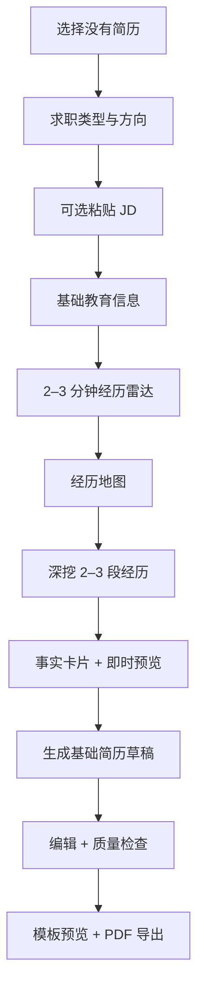
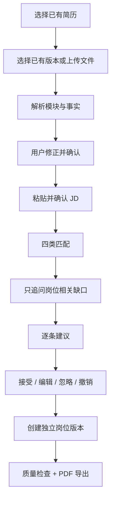

# 产品范围与用户流程

## 1. 用户和任务

### 1.1 从零创建者

用户没有可投递简历，不确定课程、竞赛、社团、兼职和志愿经历是否有价值。

成功任务：

> 在具体场景提示下找到至少两段能被面试追问的真实经历，并生成可编辑草稿。

### 1.2 岗位定向优化者

用户已有一份通用简历和目标 JD，但不知道应保留、删除、补充或重写什么。

成功任务：

> 在不编造经历的前提下，得到逐条可解释的岗位版本，并保留原简历。

## 2. 全局信息架构

登录后的一级入口：

1. **首页**：双入口、最近简历、进行中的任务。
2. **我的简历**：基础简历、岗位版本、历史版本。
3. **经历事实库**：教育、项目、实习、校园、竞赛、兼职、志愿、技能与荣誉事实。
4. **任务中心**：解析、生成、匹配和导出任务状态。
5. **个人设置**：账号绑定、隐私、数据导出、数据删除和用量。

Web 使用侧边导航；小程序使用底部导航“首页、简历、经历、我的”，任务中心从首页和我的进入。

## 3. 首次进入与账户

### 3.1 Web

1. 用户输入邮箱。
2. 系统发送 6 位验证码，10 分钟有效，同一邮箱 60 秒内不得重复发送。
3. 验证成功后创建或登录账户。
4. 首次进入必须同意用户协议与隐私政策；非必要授权单独询问。

### 3.2 微信小程序

1. 用户主动点击“微信登录”，系统不得在打开页面时静默创建账户。
2. 后端用登录凭证换取平台身份并创建内部用户。
3. 用户需要跨端同步时，绑定已验证邮箱。
4. 同一邮箱绑定已有 Web 账户时，必须二次确认；合并前展示两端简历数量。

## 4. 流程 A：从零创建

### 4.1 经历雷达

覆盖八类场景：

- 课程作业与实验；
- 个人项目与公开作品；
- 校园活动与社团；
- 竞赛与科研；
- 兼职与实习；
- 志愿服务；
- 学习成果；
- 生活中的长期责任与问题解决。

每类回答只有“有”“好像有”“没有”“跳过”。首条可用经历预览前最多展示 12 个选择题和 6 个短答题。

### 4.2 经历深挖

每段经历按以下顺序：

1. 场景和时间；
2. 团队与个人角色；
3. 具体行动；
4. 使用的方法或工具；
5. 遇到的难点；
6. 交付物、范围、反馈或数据；
7. 是否能在面试中解释。

系统不得把“好像有”“不知道”转换成肯定事实。用户输入数字时必须再次确认数字含义和单位。

### 4.3 即时反馈

每完成一段经历，系统立即生成一条简历表达。用户可以：

- 确认事实；
- 修改事实；
- 重新表达；
- 暂不使用；
- 查看每个短语来自哪条回答。

## 5. 流程 B：已有简历按 JD 优化

### 5.1 导入

支持 PDF、DOCX、TXT，单文件最大 10 MB、最多 10 页。解析失败时必须：

- 保留原文件状态；
- 展示可理解的失败原因；
- 提供粘贴文本入口；
- 允许立即删除原文件。

解析内容只有用户确认后才能进入事实库。

### 5.2 JD 匹配

每条 JD 要求只能属于以下一类：

- `proved`：已有明确事实证据；
- `underexpressed`：存在相关事实，但简历表达不足；
- `needs_confirmation`：存在模糊线索，需要用户回答；
- `real_gap`：没有证据，不能通过改写解决。

### 5.3 建议决策

每条建议必须展示：

- JD 原要求；
- 当前原文；
- 建议文本；
- 修改理由；
- 事实引用；
- 风险提示；
- 接受、编辑、忽略和撤销。

批量“全部接受”不进入本版本。

## 6. 双端功能一致性

| 能力 | Web | 微信小程序 | 数据结果 |
| --- | --- | --- | --- |
| 双入口 | 完整 | 完整 | 相同 |
| 经历雷达与动态追问 | 完整 | 完整 | 同一会话 |
| 文件导入与确认 | 拖拽、选择、粘贴 | 微信文件选择、粘贴 | 同一解析任务 |
| JD 解析与修正 | 完整 | 完整 | 同一 JD |
| 结构化编辑 | 多栏、拖拽 | 分模块、按钮排序 | 同一版本模型 |
| 建议处理 | 右侧面板 | 底部抽屉/独立页 | 同一建议状态 |
| 历史版本 | 完整 | 完整 | 同一快照 |
| PDF 预览与导出 | 浏览器预览、下载 | 全屏预览、保存/转发 | 同一服务端文件 |
| 数据删除 | 完整 | 完整 | 同一删除任务 |

“功能对等”不要求页面结构和控件代码相同，但同一用户完成同一操作后，服务端数据和后续可用操作必须一致。

## 7. 状态恢复

以下操作必须在成功写入服务端后才显示“已保存”：

- 事实确认；
- 简历条目编辑；
- 建议接受或忽略；
- 模块排序；
- JD 修正。

自动保存规则：

- 用户停止输入 800 ms 后提交；
- 15 秒内至少执行一次兜底保存；
- 离开页面前尝试提交未保存变更；
- 离线时保存本地草稿并明确显示“未同步”；
- 恢复网络后按 `base_version` 检测冲突，不静默覆盖服务端。

## 8. 错误与降级

| 错误 | 用户可见行为 |
| --- | --- |
| AI 超时 | 保留输入，显示可重试；允许继续手动编辑 |
| AI 队列繁忙 | 显示排队位置或预计等待范围；不得无限转圈 |
| 解析失败 | 提供粘贴文本；允许删除原文件 |
| 保存冲突 | 展示服务端版本与本地版本，用户选择保留内容 |
| 导出失败 | 保留版本和模板选择；可重新发起 |
| 达到用量限额 | 解释限额和恢复时间；阅读、编辑、预览不受影响 |

## 9. 产品事件

事件只记录 ID、枚举、耗时、结果和数字，不记录简历正文、JD 正文、邮箱或手机号。

必须记录：

- `entry_mode_selected`
- `radar_started`、`radar_completed`
- `experience_discovered`
- `fact_confirmed`、`fact_rejected`
- `resume_import_started`、`resume_import_confirmed`
- `jd_parse_confirmed`
- `match_completed`
- `suggestion_accepted`、`suggestion_edited`、`suggestion_ignored`
- `quality_check_completed`
- `export_requested`、`export_succeeded`、`export_failed`
- `cross_device_resume_restored`
- `account_deletion_requested`、`account_deletion_completed`

## 10. 产品完成定义

产品范围完成必须同时满足：

- 两条流程在 Web 和小程序均能独立端到端完成；
- 两端可交叉续接，不需要重新输入已确认事实；
- 所有导出内容通过事实检查；
- 任务失败不丢失已保存输入；
- [验收标准](./11-acceptance-and-evidence.md)中所有 P0 项有可复核证据。
