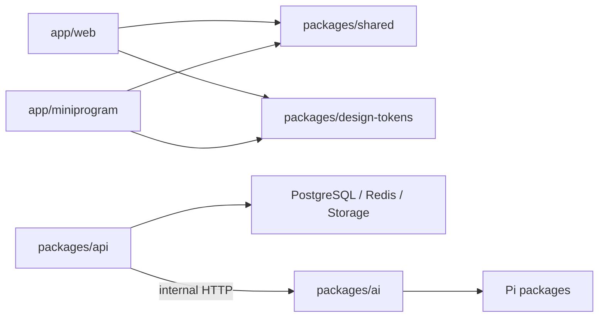

# 技术选型与代码结构

## 1. 技术原则

1. 业务规则保持简单、集中和可测试。
2. 双端共享接口契约、枚举、设计 Token 和纯函数，不强行共享页面 UI。
3. FastAPI 是业务事实入口；Pi 是内部 AI 执行层。
4. 不为 MVP 引入 Kubernetes、事件溯源数据库或多数据库微服务。
5. 生产依赖必须说明用途、锁定确切版本并通过许可证和安全扫描。

## 2. Monorepo

使用 pnpm workspace 管理 JavaScript/TypeScript 包，Python 使用独立 `pyproject.toml` 和锁文件。根脚本统一执行 lint、test、build 和契约生成。

```text
ai-Resume-optimization/
├── app/
│   ├── web/                         # Next.js
│   │   ├── app/                     # 路由
│   │   ├── components/
│   │   │   └── ui/                  # Web 基础 UI，优先复用
│   │   ├── features/                # 按业务功能组织
│   │   └── lib/
│   └── miniprogram/                 # Taro React
│       └── src/
│           ├── pages/
│           ├── subpackages/
│           ├── components/
│           │   └── ui/
│           ├── features/
│           └── platform/            # 微信平台适配
├── packages/
│   ├── api/                         # FastAPI Python
│   │   ├── app/
│   │   │   ├── modules/
│   │   │   ├── core/
│   │   │   ├── db/
│   │   │   ├── workers/
│   │   │   └── main.py
│   │   ├── migrations/
│   │   └── tests/
│   ├── ai/                          # Node.js Pi 内部服务
│   │   ├── src/
│   │   │   ├── workflows/
│   │   │   ├── prompts/
│   │   │   ├── tools/
│   │   │   ├── tracing/
│   │   │   └── server/
│   │   └── tests/
│   ├── shared/                      # 生成的 TS API 类型、枚举、客户端
│   ├── design-tokens/               # 双端颜色、间距、字号 Token
│   └── test-fixtures/               # 匿名样本与固定评测集
├── infra/
│   ├── docker/
│   ├── deployment/
│   └── observability/
├── tests/
│   ├── contract/
│   ├── e2e-web/
│   ├── e2e-miniprogram/
│   ├── performance/
│   └── acceptance/
├── artifacts/                       # 验收制品，不提交敏感原文
└── docs/
```

## 3. Web

| 领域 | 选择 |
| --- | --- |
| 框架 | Next.js App Router + React + TypeScript |
| 样式 | Tailwind CSS + CSS 变量设计 Token |
| Server state | TanStack Query |
| 表单 | React Hook Form |
| API | `packages/shared` 生成的 fetch 客户端 |
| 测试 | Vitest、Testing Library、Playwright |

规则：

- 业务页面不得直接声明后端共享类型；
- 所有服务端数据通过生成客户端；
- UI 优先复用 `app/web/components/ui`；
- 只有需要交互的边界使用 Client Component；
- 简历内容不得写入 Next.js 缓存或静态生成产物。

## 4. 微信小程序

| 领域 | 选择 |
| --- | --- |
| 框架 | Taro + React + TypeScript |
| 样式 | CSS Modules/SCSS + 生成的设计 Token |
| Server state | TanStack Query 的平台兼容用法 |
| API | 与 Web 相同的生成 fetch 客户端，使用平台请求适配器 |
| 测试 | Vitest、Taro 测试工具、微信开发者工具自动化 |

规则：

- 平台 API 只能出现在 `platform/` 适配层；
- 页面和业务组件不能直接调用 `wx.*`；
- 不依赖浏览器 DOM、Portal、任意 SVG 或 ReactDOM 专用库；
- 包体达到平台限制 80% 时构建失败。

## 5. FastAPI

| 领域 | 选择 |
| --- | --- |
| API | FastAPI + Pydantic |
| ORM | SQLAlchemy async |
| 迁移 | Alembic |
| 数据库 | PostgreSQL |
| 队列 | Celery + Redis |
| 日志 | 结构化 JSON 日志 |
| Trace | OpenTelemetry |
| 测试 | pytest、pytest-asyncio、Testcontainers |

`packages/api/app/core/errors.py` 必须提供统一的 `createApiError`，所有 HTTP 错误通过它生成以下结构：

```json
{
  "error": {
    "code": "RESUME_VERSION_CONFLICT",
    "message": "简历已在其他设备更新",
    "request_id": "req_019fa2876c0e",
    "details": {}
  }
}
```

## 6. Pi AI 服务

| 领域 | 选择 |
| --- | --- |
| 模型适配 | `@earendil-works/pi-ai` |
| Agent | `@earendil-works/pi-agent-core`，只用于多轮、受控工作流 |
| 内部 HTTP | Fastify |
| Schema | TypeBox |
| Trace | Pi 事件订阅 + OpenTelemetry |
| 测试 | Vitest + 固定模型响应夹具 |

不安装或不启用 Coding Agent 的 Shell、文件写入、浏览器和任意网络工具。Pi 工具只有业务白名单：

- `get_confirmed_facts`
- `get_jd_requirements`
- `emit_question`
- `emit_resume_suggestion`
- `emit_fact_check_result`

这些工具只操作调用方传入的内存数据，不连接数据库。

## 7. 契约生成

1. FastAPI Pydantic 模型生成 OpenAPI。
2. CI 对 OpenAPI 排序并生成稳定快照。
3. `packages/shared` 从快照生成 TypeScript 类型和客户端。
4. Pi 内部接口使用独立 OpenAPI/JSON Schema。
5. CI 检测未提交的生成差异。

禁止：

- 页面复制粘贴 DTO；
- FastAPI、Web、小程序三处各维护一个枚举；
- 直接使用 `any` 绕过生成类型；
- 手改生成文件。

## 8. 依赖方向



- `packages/shared` 不依赖任何应用。
- `packages/ai` 不依赖 Web、小程序或业务数据库代码。
- Web 与小程序不得互相导入。
- FastAPI 不通过 Node 子进程运行 Pi；生产中通过内部网络调用。

## 9. 版本政策

- 设计文档不锁定未经安装验证的精确版本号；
- 创建项目时选择当日稳定版并锁入 lockfile；
- 禁止生产构建依赖 `latest` 范围；
- 每月集中更新一次非安全依赖；
- 高危安全修复在 72 小时内评估并发布；
- Pi 升级必须先通过固定评测集和事件契约测试。

## 10. 根命令

根目录保持以下稳定命令：

```text
pnpm install
pnpm dev
pnpm lint
pnpm test
pnpm build
pnpm test:contract
pnpm test:e2e
pnpm test:performance
pnpm acceptance
```

命令必须同时覆盖 TypeScript 和 Python 子项目；任一子项目失败，根命令返回非零状态。
