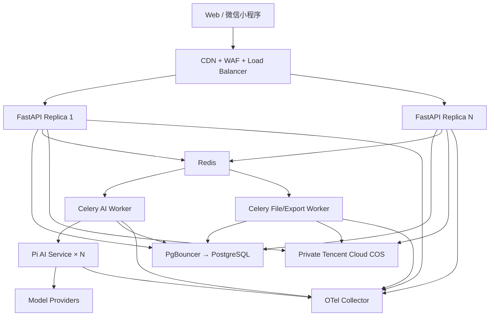
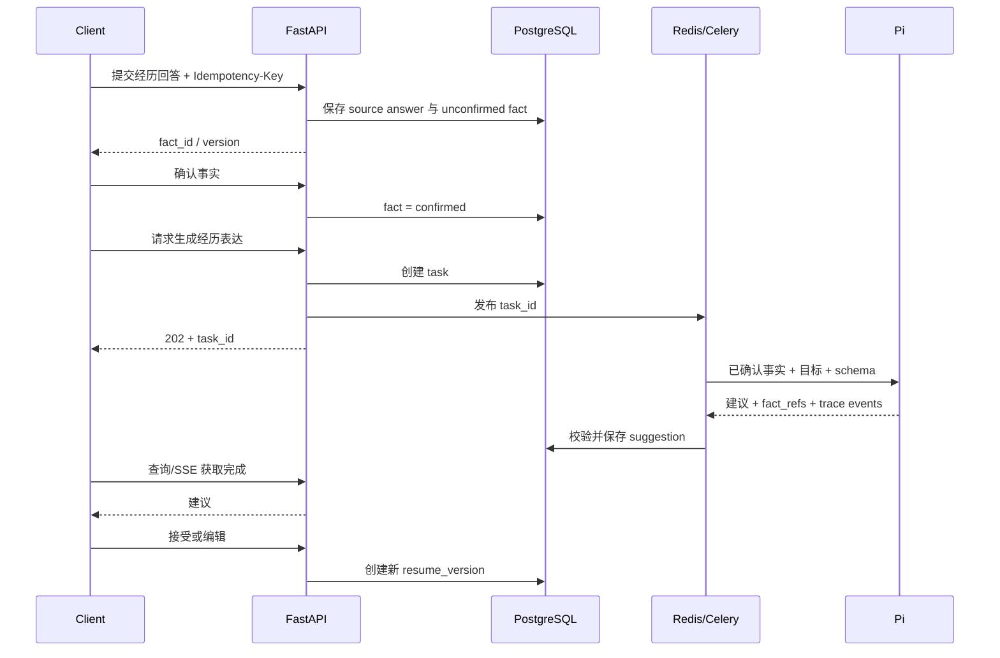

# 系统架构与数据流

## 1. 架构目标

- 在 1,000 DAU、100 峰值在线的公开 MVP 下稳定运行；
- 所有长任务可恢复、可取消、可追踪；
- AI 服务不能越过业务权限和事实边界；
- 双端读取同一业务状态；
- 个人开发者可以使用托管服务完成运维。

## 2. 生产拓扑



生产至少运行两个 FastAPI 副本。Pi 和 Worker 初始可以各运行一个实例，但必须具备健康检查和副本扩容配置。

## 3. 同步与异步边界

### 3.1 同步请求

必须在一个 HTTP 请求中完成：

- 登录和令牌刷新；
- 事实、简历、JD 和版本的读取；
- 字段编辑和排序；
- 建议接受、忽略和撤销；
- 任务状态读取；
- 上传凭证申请；
- 数据删除确认。

同步非 AI 请求服务端目标 P95 小于 500 ms。

### 3.2 异步任务

必须返回 `202 Accepted + task_id`：

- 简历解析；
- JD 解析；
- 一段经历的表达生成；
- 整份初稿生成；
- JD 匹配；
- 批量建议生成；
- 质量检查；
- PDF 导出；
- 账户数据导出；
- 账户数据删除。

异步任务状态：

```text
queued → running → succeeded
              ├→ failed
              ├→ cancelled
              └→ waiting_for_user
```

只有 `queued` 和显式声明可中断的 `running` 任务可取消。终态不可回退。

## 4. 全链路标识

每个公开请求生成或接收：

- `trace_id`：跨 FastAPI、Celery、Pi 和模型调用；
- `request_id`：单个 HTTP 请求；
- `idempotency_key`：写操作防重复；
- `task_id`：长任务；
- `actor_id`：内部用户 ID，不使用邮箱或微信 ID；
- `resource_id`：简历、JD、导出等资源。

Pi 额外生成：

- `ai_run_id`；
- `pi_session_id`，仅多轮经历挖掘使用；
- `turn_seq`；
- `tool_call_id`；
- `provider_response_id`。

## 5. 数据流 A：从零创建



Pi 只能接收与当前经历相关的事实，不接收用户全部账户数据。

## 6. 数据流 B：导入和优化

1. 客户端申请上传凭证。
2. 客户端直接上传私有对象存储。
3. FastAPI 校验对象元数据并创建解析任务。
4. Python Worker 提取 PDF/DOCX/TXT 文本和模块候选。
5. Pi 把候选文本结构化，必须返回原文范围引用。
6. 用户修正和确认后，FastAPI 才创建事实。
7. JD 解析同样经过用户确认。
8. 匹配 Worker 读取已确认事实和 JD 要求，调用 Pi 生成四类结果。
9. 用户逐条处理建议，FastAPI 创建岗位版本，不覆盖基础版本。

## 7. 文件与导出

### 7.1 上传

- 允许 MIME：PDF、DOCX、纯文本；
- 最大 10 MB；
- 文档最大 10 页；
- 上传凭证 10 分钟有效；
- 存储桶私有；
- 完成后比对客户端哈希、对象大小和声明 MIME；
- 文件名只用于展示，不作为存储键。

### 7.2 解析

- PDF 使用文本层提取；
- DOCX 读取段落、表格和顺序；
- TXT 按 UTF-8 读取；
- 扫描件、加密 PDF 和损坏文件进入可解释失败状态；
- 不在本版本执行 OCR。

### 7.3 PDF 导出

- Worker 根据不可变 `resume_version_id` 构造渲染数据；
- 使用服务端 HTML 模板和嵌入字体生成 PDF；
- 生成前运行事实、完整性和分页检查；
- 预览与导出使用同一渲染模型；
- PDF 内容哈希、模板版本和源版本写入导出记录；
- 下载 URL 10 分钟有效，文件保留 7 天。

## 8. 跨端同步

- 所有正式数据由服务端版本控制；
- 客户端缓存带 `etag/version`；
- 写入时提交 `base_version`；
- 冲突返回 `409 RESUME_VERSION_CONFLICT`；
- 自动保存不得使用“最后写入获胜”静默覆盖；
- 小程序后台恢复和 Web 刷新都重新验证版本；
- 本地草稿不得被另一端当作已确认事实。

## 9. 缓存

可以缓存：

- 静态页面和公共资源；
- 不含用户内容的配置、问题模板和模型目录；
- 用户资源的短期版本元数据；
- 任务进度事件。

不得缓存：

- 完整简历正文到 CDN；
- 未经授权的私有 API 响应；
- 邮箱验证码；
- 模型密钥；
- 用户删除后的内容。

## 10. 故障语义

| 故障 | 系统行为 |
| --- | --- |
| FastAPI 副本退出 | Load Balancer 摘除；客户端重试幂等请求 |
| Redis 短暂不可用 | 禁止创建新长任务；同步读取和编辑继续 |
| Worker 退出 | 未确认任务重新投递；幂等任务不重复产生业务结果 |
| Pi 不可用 | 任务失败或等待重试；手动编辑继续 |
| 模型供应商限流 | 指数退避，遵守最大等待；可切备用模型 |
| PostgreSQL 不可用 | 停止写入并返回明确错误；不得伪造“已保存” |
| 对象存储不可用 | 导入/导出暂停；已保存业务内容继续可读 |

## 11. 架构完成定义

- 任一服务可根据 `trace_id` 定位同一链路；
- Worker 重启后 5 分钟内恢复未完成任务；
- 同一 `idempotency_key` 重放 10 次只产生一个业务结果；
- Pi 和客户端均无法直接写 PostgreSQL；
- 通过[并发、部署与运维规格](./10-concurrency-deployment-and-operations.md)中的负载与故障测试。
