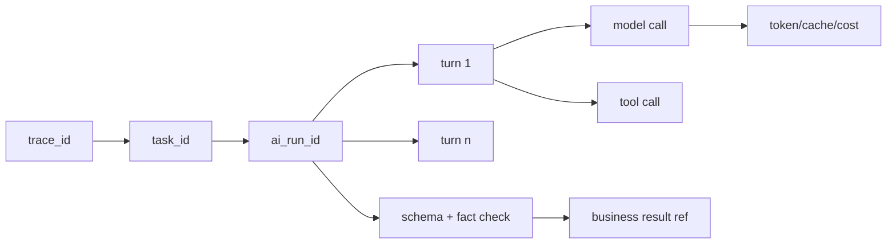

# Pi AI 工作流与链路监测

## 1. Pi 的定位

使用：

- `@earendil-works/pi-ai`：模型提供商统一接口、流式事件、tool calling、token 与成本；
- `@earendil-works/pi-agent-core`：需要多轮追问和受控工具循环时的 Agent runtime。

不使用：

- Coding Agent 的 Shell、文件系统、浏览器和任意网络工具；
- Pi 作为公开 API、用户系统或数据库；
- 未经业务校验的自由文本直接写入简历。

Pi 官方事件提供 Agent、Turn、Message、Tool 和流式生命周期；最终 `AssistantMessage` 提供 provider、model、response ID、token、cache、reasoning token 和 cost。系统在此基础上增加业务 `trace_id`、task 和事实校验事件。

## 2. 工作流

| workflow_type | 调用方式 | 说明 |
| --- | --- | --- |
| `extract_facts` | `pi-ai` 单次结构化调用 | 把已确认导入片段或回答转成事实候选 |
| `next_question` | 规则优先，必要时 `pi-agent-core` | 只追问当前经历的缺失信息 |
| `write_experience_bullet` | `pi-ai` | 只使用给定事实生成表达 |
| `parse_jd` | `pi-ai` | 输出职责、必备、加分和隐含能力候选 |
| `match_resume_to_jd` | `pi-ai` + 确定性预匹配 | 输出四类匹配 |
| `generate_suggestion` | `pi-ai` | 单条原文、事实、JD 的建议 |
| `fact_check` | 规则 + `pi-ai` | 逐原子声明检查来源 |
| `style_check` | `pi-ai` 或规则 | 重复、空话、第一人称和可读性 |

## 3. 结构化契约

所有工作流输入包含：

- `workflow_version`
- `trace_id`
- `task_id`
- `locale`
- `target`
- `confirmed_facts`
- 当前处理对象；
- 输出 JSON Schema；
- token、时间和工具调用上限。

建议输出至少包含：

```json
{
  "suggestion_text": "string",
  "atomic_claims": [
    {
      "text": "string",
      "fact_refs": ["fact_id"],
      "status": "supported"
    }
  ],
  "jd_requirement_refs": ["requirement_id"],
  "reason": "string",
  "risk_flags": [],
  "requires_user_confirmation": false
}
```

Schema 验证失败不得尝试从自由文本正则“抢救”后写入业务数据。最多执行一次纠错调用，仍失败则任务失败。

## 4. Agent 工具

允许工具：

| 工具 | 输入 | 输出 | 副作用 |
| --- | --- | --- | --- |
| `get_confirmed_facts` | fact ID 白名单 | 调用输入中的事实 | 无 |
| `get_jd_requirements` | requirement ID 白名单 | 调用输入中的要求 | 无 |
| `emit_question` | 结构化问题 | 问题候选 | 无 |
| `emit_resume_suggestion` | 建议 Schema | 建议候选 | 无 |
| `emit_fact_check_result` | claim 与 fact refs | 检查结果 | 无 |

`beforeToolCall` 必须：

- 检查工具白名单；
- 验证 TypeBox 参数；
- 检查调用次数；
- 阻止未知 ID；
- 记录 `tool_execution_start`。

`afterToolCall` 必须：

- 移除非必要文本；
- 标记是否 Schema 有效；
- 记录耗时和结果状态；
- 不记录完整用户正文；
- 达到结束工具后终止循环。

单次 Agent run 最多：

- 4 个 turn；
- 6 次工具调用；
- 30 秒；
- 12,000 个总 token；
- 1 次自动模型切换。

## 5. 事实校验

生成文本先分解为原子声明：

- 角色；
- 行动；
- 方法或工具；
- 范围；
- 数字；
- 结果；
- 技能判断。

每条声明状态：

- `supported`：至少一个已确认 fact 引用直接支持；
- `needs_confirmation`：存在相关信息但不足以肯定；
- `unsupported`：没有来源或与来源矛盾。

规则优先检查：

- 新数字；
- 新工具名；
- 新职位/角色；
- 新奖项；
- 新业务结果；
- 绝对化表述。

任一 `unsupported` 或 `needs_confirmation` 声明阻止建议自动进入正式版本。数字声明只有精确来源或用户再次确认才能导出。

## 6. 模型路由

模型不在业务代码中写死。路由配置按工作流指定：

- 主模型；
- 备用模型；
- 最大 token；
- thinking level；
- 超时；
- 重试次数；
- 单次成本上限。

选择原则：

- 提取和分类优先低成本、稳定结构化输出；
- 建议和事实检查使用更强模型；
- 敏感数据只发送给已完成数据政策审核的供应商；
- 模型切换必须保留同一 `trace_id` 并记录原因。

## 7. 链路模型



### 7.1 `ai_runs`

保存汇总：

- `ai_run_id`、`trace_id`、`task_id`；
- workflow 类型和版本；
- provider、requested model、response model；
- started、first_token、finished 时间；
- stop reason；
- input/output/cache/reasoning token；
- provider 报告成本和换算人民币成本；
- turn/tool 次数；
- Schema 与事实校验结果；
- retry 和 fallback 次数；
- 最终业务对象引用；
- prompt template 版本和输入哈希。

### 7.2 `ai_trace_events`

追加事件：

- `run_queued`
- `agent_start`
- `turn_start`
- `message_start`
- `first_token`
- `message_end`
- `tool_execution_start`
- `tool_execution_end`
- `turn_end`
- `auto_retry_start`
- `auto_retry_end`
- `model_fallback`
- `schema_validation_failed`
- `fact_validation_failed`
- `agent_end` / `agent_settled`
- `run_succeeded` / `run_failed` / `run_cancelled`
- `user_accepted` / `user_edited` / `user_ignored`

每个事件包含 `event_seq`，同一 run 内从 1 连续递增。

## 8. 隐私与日志

不得写入链路：

- 完整 Prompt；
- 完整简历或 JD；
- 邮箱、手机号、姓名、微信标识；
- thinking/reasoning 文本；
- 原始文件；
- 模型密钥；
- Tool 的完整用户文本参数。

允许写入：

- ID、哈希、枚举、长度；
- 事实引用 ID；
- Schema 错误路径；
- token、成本、延迟；
- 风险标签；
- 经过截断和脱敏的错误码。

业务数据库可以保存用户最终确认内容；链路系统只保存可观测元数据。

## 9. 指标和告警

指标：

- AI 成功率；
- 首 token 和总耗时 P50/P95/P99；
- 每工作流 token 和成本；
- Schema 首次通过率；
- 事实校验失败率；
- retry、fallback 和 abort 率；
- 建议接受、编辑和忽略率；
- 无来源声明率；
- provider 错误码；
- 队列等待时间。

告警：

- 5 分钟 AI 成功率 < 95%；
- P95 总耗时 > 30 秒持续 10 分钟；
- Schema 首次通过率 < 98%；
- 任一严重无来源事实通过导出；
- 日成本达到 70%、90%、100%；
- 10 分钟内 provider 429 超过 20 次；
- trace 完整率 < 99.5%。

## 10. Pi 契约测试

每次 Pi 或模型配置升级必须证明：

- 官方事件映射覆盖已知事件；
- 未知事件被安全记录为 `unknown`，不导致 run 丢失；
- 100 个固定响应中 event_seq 连续；
- `agent_end/settled` 后 run 正确进入终态；
- retry 和 fallback 不重复写业务结果；
- usage 汇总等于各消息 usage 之和；
- provider 账单抽样差异不超过 2%；
- 链路敏感信息扫描为 0 个命中。

## 11. 参考

- [Pi 仓库与包边界](https://github.com/earendil-works/pi)
- [Pi SDK 与生命周期事件](https://pi.dev/docs/latest/sdk)
- [Pi JSON Event Stream](https://pi.dev/docs/latest/json)
- [Pi RPC 事件](https://pi.dev/docs/latest/rpc)
- [Pi AI 类型中的 Usage 与成本字段](https://github.com/earendil-works/pi/blob/main/packages/ai/src/types.ts)
